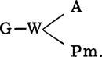
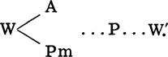
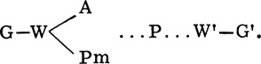
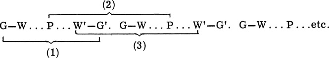
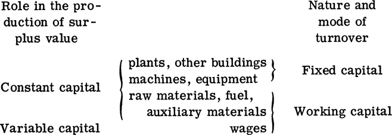
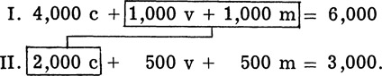
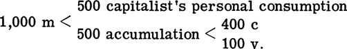
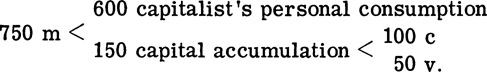
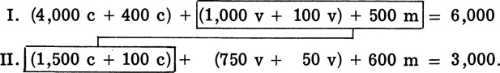

[*6* The Process of the Movement of Capital Is the Process of Exploiting and Realizing Surplus Value](#) 
=========================================================================================================================================

[The Circular Flow of Capital, the Turnover of Capital, and the
Reproduction of Social Capital](#)<a id="s_a">[[\*]](#bot_s_a)</a>

Capital must be in constant motion to play its role. It passes from the
exchange process to the production process and then from the production
process to the exchange process in an endless repetition.

In the previous two chapters, we temporarily ignored the exchange
process and looked at capital in the production process. In this
chapter, we shall analyze the motion of capital and its inherent
contradictions from the exchange viewpoint.

[The Circulation of Capital Passes through Three Phases and Takes Three Forms]
---------------------------------------------------------------------------------------------------------------------------

### _The Three Phases of Capital Circulation Represent the Unity between the Production Process and the Exchange Process_

In its motion, capital passes successively through three phases and
takes three corresponding forms.

In the first phase of capital motion, the capitalist must
first take out a certain amount of money to purchase means of production
and labor force in the market. Using G to represent money, W
commodities, A labor force, and Pm means of production, this process can
be illustrated as follows:

In this phase, the money in the capitalist's hands serves as a means of
purchase and a means of payment. However, at the same time, it also
serves as capital because what the capitalist purchases are the labor
force and means of production needed to extract surplus labor from the
laborer. Here money becomes money capital. Through the purchase of means
of production and labor power, money capital is transformed into
production capital. Without money capital, there is no production
capital and no production of surplus value. The function of money
capital is to prepare for the creation of surplus value.

In the second phase of capital motion, the capitalist engages in
production by combining the means of production with the labor force.
Thus, the exchange process of capital is terminated, and its production
process is started. Through this process, labor power is consumed, raw
materials are processed, equipment is worn down, and a certain amount of
commodities is produced. Production capital is thereby transformed into
commodity capital.

The commodity capital in this phase already embodies the surplus value
created by the worker. It not only looks different from the commodities
bought earlier but also has higher value than the original capital.

This process can be illustrated as follows:

Here P represents production capital in the production
process. The dotted lines before and after P denote the termination of
exchange and the beginning of production. W' represents commodities with
embodied surplus value.

In this phase, the means of production and the labor force not only play
the role of factors of production but also the role of capital because
these means of production and labor force are combined in the hands of
the capitalist for the production of surplus value. The function of
production capital is the production of surplus value.

In the third phase of capital motion, the capitalist must take the
commodities which have thus been produced and embodied with surplus
value to the market for sale. Through the sale of commodities, commodity
capital is again transformed into money capital. Thus, capital is
converted back to the form of money.

This process can be illustrated as follows:

W′--G′.

Here G' denotes money capital whose value has been augmented. It
consists of both the value of capital advanced by the capitalist and of
the realized surplus value. Therefore W'--- G' is not only a
transformation process in form between commodities and money, but more
importantly, is also a process in which the surplus value embodied in
the commodities and expropriated by the capitalist is realized. The
function of commodity capital is to realize surplus value.

The three phases and three forms of capital show that capital in each of
the phases and forms performs an independent function. After a certain
function has been performed, it passes into another phase and takes
another form. This capital which goes through these successive
transformations is industrial capital. This so-called industrial capital
not only includes manufacturing capital, but also the capital in other
material production sectors such as agriculture and construction. This
capital changes its form successively and passes through three phases to
increase its value and then returns to its starting point. This motion
is the circulation of capital. Its entire process can be
shown as follows:

In the circulation of industrial capital, the first and third phases are
exchange processes; the second is a production process. The production
process plays the determining role in these three phases because it is
the only process which can produce surplus value. In the first and third
phases, merely the form of capital is transformed; its value remains
constant. However, the exchange processes are indispensable for the
circulation of industrial capital. Without the exchange processes, the
capitalist would not be able to produce and realize surplus value.
Therefore, the circular flow of industrial capital is the unity between
the production and exchange processes. Because of this, the three phases
of circulation in industrial capital must be interrelated, and capital
must pass from one phase to another. If the circulation of capital is
hindered in the first phase (G---W), it becomes hoarded money and cannot
play the role of capital. If its circulation is hindered in the second
phase, there will be no production of surplus value. If its circulation
is hindered in the third phase, then the surplus value created cannot be
realized.

### _The Circulation of Industrial Capital Represents the Unity among Three Circular Flows_

To extract surplus value continuously, the capitalist must ensure the
continuous circulation of capital. Thus, the formula for the circulation
of industrial capital is endless:

The above formula shows that the continuous motion of
industrial capital assumes not merely one, but three, circular flows,
namely, (1) circulation of money capital: G ... G'; (2) circulation of
production capital: P...P; and (3) circulation of commodity capital:
W'---W'. To ensure the continuous circulation of capital, the capitalist
must ensure that his capital exists simultaneously in three forms and
that the capital in its three forms circulates continuously according to
the circulation flows. For example, say a capitalist has 60,000 yuan of
capital. He divides it into three parts, with 20,000 yuan in the form of
money capital, 20.000 yuan in the form of production capital, and 20,000
yuan in the form of commodity capital. They are made to circulate along
their respective courses. Thus, while this capitalist transforms 20,000
yuan of commodity capital into money capital, 20.000 yuan of production
capital is being transformed into commodity capital and 20,000 yuan of
commodity capital into production capital. If all 60,000 yuan were in
one form, production could not be carried on continuously, but only
intermittently. If the circulation of capital in any one of the three
forms is hindered in its motion so that circulation is interrupted, for
example, if commodities cannot be sold and commodity capital cannot be
transformed into money capital, then the circulation of the whole
capital is destroyed, and the motion of capital interrupted. Thus, the
capitalist is forced to close down production.

[The Turnover of Capital Is the Continual Production and Realization of Surplus Value](#)
-----------------------------------------------------------------------------------------------------------------------------------

### _The Length of Production and Exchange Time Determines the Speed of Capital Turnover_

The circulation of capital continues in an endless repetition. The
continuous circulation of capital is called the turnover of capital.
Marx pointed out, "When the circulation of capital is regarded as a
periodic process and not as isolated incidents, it is called the
turnover of capital." <a id="1">[[1]](#bot_1)</a>

The turnover of capital passes through the production and
exchange spheres. The period when capital is in the
production sphere is called the production time of capital. The period
when capital is in the exchange sphere is called the exchange time of
capital. The sum of these two constitutes the turnover period of
capital.

The production period of capital includes the following three parts:

First, the period when the means of production perform their function in
production. This is primarily the labor time spent by the laborer on
objects of labor to produce certain products. The length of labor time
is determined by two factors. One is the nature of the production
sector. For example, a yarn mill can spin a certain amount of cotton
into yarn in one day; but a shipyard takes several months or years to
build a ship. Thus, the latter requires longer labor time than the
former. Another is the labor productivity of the enterprise. Among
enterprises producing the same kind of product, the enterprise with
higher labor productivity takes a shorter time to produce the product.
On the other hand, a longer time is required by enterprises with lower
labor productivity. In some production sectors, the period when the
means of production perform their function in the production process
also includes time needed for natural forces to act on the objects of
labor as well as labor time. For example, wine brewing requires time for
fermentation, timber takes time to dry, and crops take time to grow.

Second, the period when production is interrupted but the means of
production still stay at the production sites. For example, when
machines and equipment are idle at night or because they are out of
order.

Third, the period when the means of production have already passed into
the production sphere but not into the production process. For example,
the time when raw materials are stored.

Among these periods, labor time is the most important. Only in this
period can the worker create value and surplus value. Therefore, the
capitalist always tries his best to shorten the other times in order to
make production time approximate labor time and extract more surplus
value from a given amount of capital in a given period of
time.

The exchange period of capital includes both the time for the
transformation of money capital into production capital, that is, the
time when the capitalist purchases the means of production and labor
force, and the time for the transformation of commodity capital into
money capital, that is, the time when the capitalist sells his
commodities.

The length of capital circulation is determined primarily by the supply
and demand conditions in the market, the distance between the point of
production and the market, and the conditions of transportation.

Because of the varying effects of the above factors on different
production sectors and enterprises, the production period and exchange
period of capital vary among them so that the turnover period of capital
is not uniform.

Because of the differences in the turnover time of capital, the speed of
turnover also varies (the speed of capital turnover is calculated on an
annual basis). Suppose the capital of a certain capitalist takes one
month to be transformed from money to production capital and from
commodity to money capital and the capital production period is three
months. Then it takes four months for the capital to turn over once.
Thus, the capital turns over three times a year. Further suppose that
the capital of another capitalist turns over once every half a year.
Then the annual rate of capital turnover is two.

From the above analysis, one knows that the rate of capital turnover is
determined ultimately by the production and circulation periods of
capital.

### _The Effects of Capital Composition on the Rate of Capital Turnover_

In the above analysis, we assume that every part of the production
capital is transformed into commodity capital in one process. But, in
fact, the nature and mode of circulation of the various parts of the
means of production are all different. From this viewpoint, the
composition of production capital can be divided into fixed
and working capital.

Fixed capital refers to capital in the form of plants, machines, and
equipment. It is paid for in one installment. Its material forms
participate in the production process in its entirety and are used more
than once. But its value is transferred to the new products gradually
according to the rate of depreciation. Because of the special way in
which the value of this capital is transferred, we call it fixed
capital. For example, if one lathe costs 4,000 yuan and lasts for ten
years, then every year 400 yuan of capital value is transferred to the
products produced. When the products are sold, 400 yuan of capital value
returns to the hands of the capitalist in the form of annual
depreciation. The value of this lathe will be completely transferred in
ten years.

Working capital refers to that part of the capital which exists in the
form of raw materials, fuel, and auxiliary materials or which is used to
purchase labor power. Raw materials, fuel, and auxiliary materials lose
their material forms in one production process, and their values are
completely transferred to the new products in one process. When the
products are sold, the total value of this capital returns to the hands
of the capitalist in the form of money. Therefore, capital used to buy
raw materials, fuel, and auxiliary materials is called working capital.
That part of the working capital which is used to purchase labor power
does not have its value transferred to the new products. An equivalent
value in the new products is created by the new labor of the worker.
Although this part of the working capital used to purchase labor power
has this characteristic, its mode of value circulation is similar to the
working capital used to purchase raw materials, fuel, and auxiliary
materials. Because the value produced by the worker in the production
process which is equivalent to the value of labor power is also
transferred to the products in one process and returns with the sale of
products, the capital used to purchase labor power is also working
capital.

Now, we know that Marx classified capital into two categories. In the
chapter on the production of surplus value, we talked about
the classification of capital into constant and variable
capital based on the different roles capital plays in the production of
surplus value. This classification makes us understand that surplus
value is produced by variable capital and reveals the secret of the
capitalist's exploitation of the worker. In this chapter, the
classification of capital into fixed and working capital is based on the
nature and mode of turnover of various parts of capital. This
classification allows us to understand the various factors affecting the
speed of capital turnover from the composition of capital.

These two classifications of capital can be illustrated as follows:

We mentioned above that the value of fixed capital is transferred
gradually to new products according to its rate of depreciation. This
depreciation has direct effects on the size of the value of fixed
capital being transferred and the speed of turnover. To further study
the characteristics of fixed capital turnover, we must also analyze the
depreciation of fixed capital.

The depreciation of fixed capital can be classified as visible or
invisible according to the reasons for its occurrence. Visible
depreciation is primarily the result of use in the production process
and secondarily of the action of natural forces, such as the decay of
timber and the corrosion of iron. Therefore, this depreciation is also
called material depreciation. Invisible depreciation is due to the
improvement in production techniques which reduces the socially
necessary labor time to produce similar machines and thus
reduces the value of the original fixed capital. It is also due to the
appearance of new and better machines, leading to a decrease in the
value of the original machines. The depreciation due to a decrease in
the value of the original machines is called nonmaterial, or invisible,
depreciation. To avoid such depreciation, the capitalist endeavors to
lengthen working hours, raise labor intensity, and adopt shifts to
accelerate the turnover of capital and increase the exploitation of the
worker in order to recover the value of fixed capital as soon as
possible.

Because of the differences in the speed of turnover between fixed and
working capital, the speed of capital turnover generally refers to the
average speed of capital turnover. The general turnover speed of capital
advanced is determined by the average turnover speed of various
components of capital. The formula to calculate it is to divide the
total capital advanced into the total capital turnover in one year. The
following table shows the general turnover of capital advanced. All
figures are hypothetical.

Components of production capital

Value (yuan)

Number of turnovers per year

Total amount of turnover per year (yuan)

------------------------------------------------------------------------

Fixed capital

100,000

1/10

10,000

 Plants

30,000

1/30

1,000

 Machines

60,000

1/10

6,000

 Small tools

10,000

3/10

3,000

Working capital

50,000

4

200,000

------------------------------------------------------------------------

Total capital advanced

150,000

1.4

210,000

From the above table, we can see that dividing the total capital
advanced, 150,000 yuan, into the total capital turnover, 210,000 yuan,
gives us the turnover speed of the total capital advanced
as being equal to 1.4. We can also see that the composition of
production capital has an effect on the speed of capital turnover. The
turnover speed of fixed capital is low, while that of working capital is
high. If the share of fixed capital is large, the turnover speed of the
total capital will be low. On the other hand, if the share of working
capital is large, then the turnover speed of the total capital is high.

### _The Capitalist Tries His Best to Accelerate the Speed of Capital Turnover to Extract More Surplus Value_

The speed of capital turnover has a direct bearing on the production of
surplus value. The acceleration of the speed of capital turnover not
only can reduce the amount of capital advanced, but can also accelerate
the turnover of variable capital in working capital so that more surplus
value is produced. Suppose two capitalists both have 2,000 yuan of
variable capital and the rate of surplus value is 100 percent for both
of them. If the capital of A turns over once a month and the capital of
B turns over once every six months, A can obtain 24,000 yuan of surplus
value a year, but B can only obtain 4,000 yuan of surplus value a year.
Even though their rates of surplus value are equal, the annual rates of
surplus value (the ratio between the surplus value produced in one year
and the total value of variable capital advanced in one year) are
different:

  --------------------------------------------------------------------------------------------------------------------- --
  $$\text\frac}} = \frac = 1,200\%$$   
  --------------------------------------------------------------------------------------------------------------------- --

  ------------------------------------------------------------------------------------------------------------------- --
  $$\text\frac}} = \frac = 200\%.$$   
  ------------------------------------------------------------------------------------------------------------------- --

Therefore, though the amount of variable capital advanced by capitalist
A and capitalist B is the same, the speed of capital turnover for
capitalist A is six times the speed of capital turnover for capitalist
B. Consequently, the surplus value obtained is also six times as great.

The capitalist always tries his best to shorten the
turnover time of capital, namely, the production time and exchange time,
to accelerate the turnover of capital and obtain more surplus value. To
achieve this objective, the capitalist lengthens the worker's labor
time, raises labor intensity, and improves production methods in the
production sphere to shorten production time. In the exchange sphere, he
develops transportation, postal and telecommunications services, and
improves business organization to shorten exchange time. However, the
inherent contradictions of capitalism hinder the improvement of
techniques and impose difficulties on the sale of commodities.
Therefore, the capitalist's attempt to accelerate the turnover of
capital is not always successful.

[Capitalist Reproduction Is Realized Spontaneously amidst Antagonistic Contradictions](#)
-----------------------------------------------------------------------------------------------------------------------------------

### _Social Capital Is the Sum of Individual Capital_

There exist numerous capitalist enterprises in the capitalist society.
Each enterprise's individual capital functions independently with
respect to other capital to augment value. However, this individual
capital is not mutually exclusive. It is interrelated and interdependent
because every individual capital must be associated with other capital
through the exchange process in order to augment value. Take the example
of a yarn mill. It has to be associated with enterprises that supply
spinning machines and cotton. On the other hand, it must also be
associated with enterprises that consume its products, such as the
weaving enterprises. Therefore, close and mutually dependent
associations exist between various enterprises. Through these
associations, the individual capital forms an organic whole. The sum of
this associating individual capital constitutes the social capital. The
sum of the movement of the individual capital constitutes the movement
of social capital.

Our earlier analysis of the circulation and turnover of capital was
conducted from the viewpoint of the reproduction of individual
capital. It dealt primarily with the production and
realization of surplus value. We have not analyzed where the capitalist
sells his commodities, where he purchases his means of production, and
where the capitalist and the worker purchase their means of subsistence.
However, when we analyze the reproduction of social capital, things are
different. Because the social capital already comprises all individual
capital, material means consumed in its reproduction process can only be
replenished from the total social product. Thus, whether the gross
social product can replenish in kind the various inputs consumed in the
current production, and if so, how, constitutes an important problem
concerning how social reproduction proceeds. As Lenin pointed out: "The
problem now involves where do the worker and the capitalist obtain their
consumer goods, where does the capitalist obtain his means of
production, and how can products satisfy these needs and permit expanded
reproduction? Here it is not only a question of 'value replenishment,
but also the replenishment of products in kind.'"
<a id="2">[[2]](#bot_2)</a> Therefore, the
reproduction of social capital must be examined in terms of
replenishment in value as well as in terms of replenishment in kind.

Marx clearly pointed out that the total social product of capitalism can
be divided, in value terms, into constant capital (c), variable capital
(v), and surplus value (m). In material terms, it can be classified
according to its function in the reproduction process into means of
production and means of consumption.

To correspond to the classification of products in kind, Marx divided
the whole social product into two sectors: the first was the production
of means of production (I), namely, the production of machines,
equipment and raw materials; the second was the production of means of
consumption (II), namely, the production of food, clothing and daily
commodities. Within each category, many production departments were
included.

### _Necessary Conditions for Simple Reproduction_

To facilitate exposition, we assume that there are only the bourgeoisie
and the proletariat in the capitalist society. The
production cycle is one year, and the total value of
constant capital is transferred to new products in one production cycle.
All commodities are sold according to their values, and there is no
fluctuation in the values and prices of commodities; nor is there
foreign trade. Under these assumptions, the realization of total social
product under simple reproduction can be expressed as follows:

1.  4,000 c + 1,000 v + 1,000 m = 6,000
2.  2,000 c + 500 v + 500 m = 3,000.

Here we assume that in the first sector the constant capital is 4,000,
the variable capital 1,000, and the surplus value 1,000. The total value
of products is 6,000. Its material forms are the means of production. In
the second sector, the constant capital is 2,000, the variable capital
500, and the surplus value 500. The total value of products is 3,000.
Its materials are means of consumption.

To continue reproduction, the products of both sectors must be realized.
What is the realization of products? It is to say that things that have
been consumed must be replenished in value terms and at the same time be
replaced in kind. In common language, it must be possible to sell them
and buy them back. In the following we will see how the products of
these two sectors are realized.

First are the internal exchanges within the first sector. In the
beginning of the year when the production process starts in the first
sector, there are means of production valued at 4,000. Suppose at the
end of the year when the production process is completed, all of them
have been consumed. In order to carry on simple reproduction in the
second year, new means of production valued at 4,000 must be
replenished. Where can the capitalist obtain these means of production?
They can only be obtained by exchanging commodities within the sector
because only the first category produces means of production. For
example, the capitalist of the machine-building plant buys iron and
steel from the capitalist of the iron and steel mill, the
capitalist of the iron and steel mill buys coking coal from
the capitalist of the coking plant and machines from the
machine-building plant\_\_\_Thus, through exchanges within the first
sector, 4,000 c can be replenished and exchanged both in value terms and
in material forms. Just as Marx said, "These exchanges are between one
type of constant capital and another; that is, between one type of means
of production and another."
<a id="3">[[3]](#bot_3)</a>

Next are the internal exchanges within the second sector. In the second
sector, when the production process is completed at the end of the year,
the worker receives 500 in wages to be spent on personal consumption.
The capitalist gets 500 in surplus value. Under simple reproduction,
there is no capital accumulation. The 500 in surplus value is also spent
on means of consumption. Then, where can they buy the means of
production they want? Only within the second sector because only the
second sector produces means of consumption. Through internal exchanges
within the second sector, that part of the product representing 500 v
and 500 m can be realized in value terms as well as in material forms.

Finally, there are exchanges between the two sectors. After the above
two types of exchanges, products valued at 1,000 v and 1,000 m still
remain in the first sector. In the second sector, products valued at
2,000 c still remain in the second sector. These two remaining parts of
products cannot be realized within their own sectors because the 1,000 v
and 1,000 m in the first sector, in value terms, should be used for
personal consumption by the worker and capitalist. However, these
products are means of consumption, not means of production. In the
second sector, the 2,000 c in value terms should be used by the
capitalist to replenish means of production consumed; but these are
means of consumption, not means of production. How can these
contradictions be resolved? They can only be resolved through exchanges
between the two sectors. The result of these exchanges is that the
worker and the capitalist in the first sector obtain their means of
consumption and the capitalist of the second sector obtains means of
production needed for reproduction the next year. The exchanges between
these two sectors can be illustrated in the following chart:

The result of the whole exchange process shows that under simple
capitalist production there must be a given proportional relationship
between the two sectors; namely, the sum of variable capital and surplus
value of the first sector must be equal to the constant capital of the
second sector in value term s. In other words, I (1,000 v + 1,000 m)
must be equal to II 2,000 c in the above example. Only by maintaining
such a proportional relationship can simple capitalist reproduction be
carried on. Therefore, I (v + m) = II c is the condition for the
realization of social product under simple capitalist reproduction.

### _Necessary Conditions for Expanded Reproduction_

We know that the characteristic of capitalist reproduction is expanded
reproduction. To carry on expanded reproduction, the capitalist cannot
consume all his surplus value. He must continuously convert part of the
surplus value into capital to expand the scale of production. To do so,
the capitalist must use part of his newly created capital as constant
capital to buy machines and raw materials needed for expanded
reproduction. The rest is converted into variable capital to hire
additional workers. Therefore, to carry on expanded capitalist
reproduction, the total annual products of the first sector must have
surplus means of production in addition to those needed to replenish
what has been consumed in the first and second sectors during the year.
This condition can be expressed in terms of an inequality: I (c + v + m)
\> I c + I I c. Both sides of the inequality contain I c, showing that
means of production consumed in the first sector can be replenished from
within the same sector. If we cancel out internal replenishments and
concentrate on the relationship between the first and the second
sectors, the above formula can be expressed as I (v + m) \> II c. This
is to say that the variable capital and surplus value of the first
sector should be larger than the constant capital of the
second sector. This is a precondition for expanded capitalist
reproduction.

The following chart is used to show how the social product is realized
under conditions of expanded capitalist reproduction:

1.  4,000 c + 1,000 v + 1,000 m = 6,000
2.  1,500 c + 750 v + 750 m = 3,000.

The above are hypothetical production figures for the first year. They
meet the requirement for I(c + v + m) \> I c + II c or I (v + m) \> II
c. Now that the capitalist wants to expand reproduction, he cannot spend
all the extracted surplus value on consumption. Suppose the capitalist
in the first sector spends half of 1,000 m on personal consumption and
converts the other half as added capital in the same proportion as the
original organic composition of capital, that is, 4:1 (4,000 c: 1,000
v). The distribution of 1,000 m is as follows:

We know that the 400 for added constant capital in the first sector is
spent on means of production. Its material forms are also means of
production. Therefore, they can be obtained through internal exchanges
within the first sector. But the 100 for added variable capital in the
first sector is used to hire additional workers who will spend it on
means of consumption. However, its material forms are means of
production. Therefore, it must be exchanged with the second sector to
obtain means of consumption.

Because the material forms of the added variable capital 100 in the
first sector are means of production and must be exchanged with the
second sector for means of consumption, this creates conditions for
expanded reproduction in the second sector. But it also requires the
second sector to carry on corresponding capital accumulation for
expanded reproduction to meet the increased demand for
means of consumption from expanded reproduction in both sectors. Suppose
the capitalist of the second sector exchanges part of his surplus value
(100 m) for means of production from the first sector to be converted
into added constant capital and uses another 50 m as added variable
capital in order to conform to the proportion of the original organic
composition of capital in the second sector, namely 2:1 (1,500 c: 750
v). Then 750 m will be distributed as follows:

Through the above capital accumulation, the products of the two sectors
are rearranged as follows:

1.  (4,000 c + 400 c) + (1,000 v + 100 v) + 500 m = 6,000
2.  (1,500 c + 100 c) + (750 v + 50 v) + 600 m = 3,000.

M

Thus, the capital of the two sectors is larger than the original capital
advanced, and the conditions for expanded scale of production in the
following years in both sectors are guaranteed.

Then, under the condition of expanded reproduction, how are the products
of the two sectors realized?

Under the condition of expanded reproduction, the realization of social
production is carried on in three aspects just as in simple
reproduction: internal exchanges within the first sector, internal
exchanges within the second sector, and exchanges between the two
sectors. In terms of charts, it is:

Through the above exchanges, the capital of each sector is larger than
the original capital advanced. The composition of capital in the second
year is as follows:

1.  4,400 c + 1,100 v = 5,500
2.  1,600 c + 800 v = 2,400.

If the rate of exploitation stays at 100 percent in this year, the
production of the two sectors in the second year is:

1.  4,400 c + 1,100 v + 1,100 m = 6,600
2.  1,600 c + 800 v + 800 m = 3,200.

Compared with the first year, expanded reproduction has been realized.

### _The Contradictions of Capitalist Reproduction Are Antagonistic_

Through the above analysis, we know the necessary conditions for the
realization of social product under capitalist simple and expanded
reproduction. But this is not to say that these conditions always exist
in the capitalist society. In fact, these conditions are frequently
violated in the capitalist society. Just as Lenin pointed out: "Abstract
theory of realization assumes, and should assume, that products are
distributed proportionally in the various departments of capitalist
production. But such an assumption does not imply that products are, or
can always be, distributed proportionally in the capitalist society."
<a id="4">[[4]](#bot_4)</a> This is due to the
fact that in the capitalist society, means of production and products
are privately owned by the capitalist and the whole social production is
governed by competition and chaotic production conditions. Thus, the
proportional relationship between the two sectors and among production
departments within each of the sectors is frequently violated. Because
of the antagonistic contradiction due to the immense increase of
productive forces in the capitalist society and the relative decrease of
effective demand from the laboring masses, the necessary proportional
relationship between the two sectors cannot always be maintained.
Therefore, capitalist reproduction cannot but encounter all sorts of
difficulties and obstacles.

There exists a series of antagonistic contradictions in the
capitalist reproduction process. These contradictions in due course
inevitably lead to economic crises.

### _Major Study References_

Marx, _Capital_, Vol. 2, chaps. 1, 2, 3, 7, 8, 20, 21.

Lenin, "On the So-called Problem of the Market," _Complete Works of
Lenin_, Vol. 1.

### _Review Problems_

1\. How does the capitalist extract more surplus value through the
circulation and turnover of capital?

2\. What are the conditions for the realization of capitalist
reproduction? Are these conditions always satisfied in the capitalist
society? Why?

_Notes_
-------------------

<a id="bot_s_a">[[\*]](#s_a)</a> Tzu-pen ti yun-tung kuo-ch'eng shih cha-ch'ii
ho shih-hsien sheng-yii chia-chih ti kuo-ch'eng --- tzu-pen hsün-huan
chou-chuan ho she-hui tzu-pen ti tsai sheng-ch'an.

<a id="bot_1">[[1]](#1)</a> Marx, _Capital_, Vol. 2, _Complete
Works of Marx and Engels_, Vol. 24, p. 174.

<a id="bot_2">[[2]](#2)</a> "The Development of Russian Capitalism,"
_Complete Works of Lenin_, Vol. 3, p. 31.

<a id="bot_3">[[3]](#3)</a> Marx, _Capital_, Vol. 2, _Complete
Works of Marx and Engels_, Vol. 24, p. 473.

<a id="bot_4">[[4]](#4)</a> "The Theory of Realization Once Again,"
_Complete Works of Lenin_, Vol. 4, p. 61.
