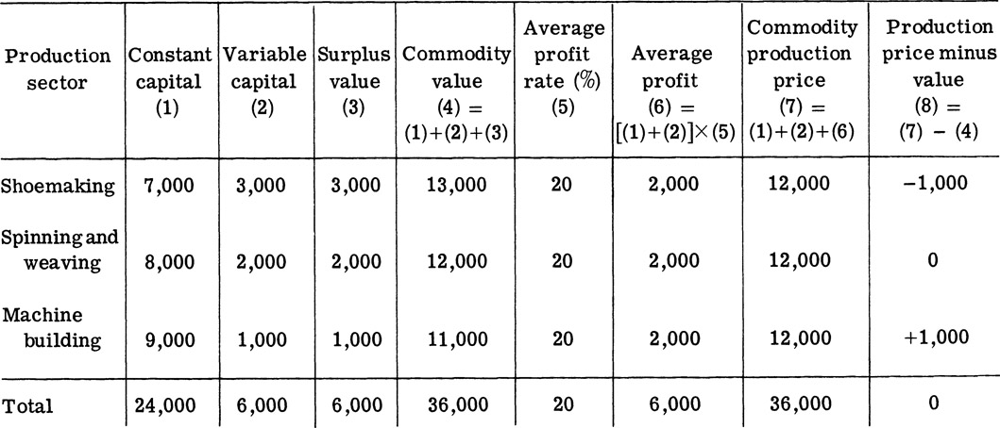
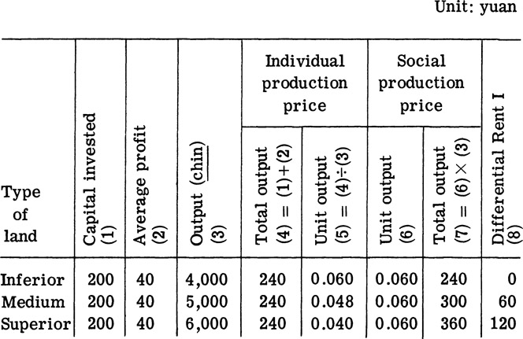

[*7* The Entire Bourgeoisie Exploits and Oppresses the Workers](#) 
====================================================================================================

[The Division of Surplus
Value](#)<a id="s_a">[[\*]](#bot_s_a)

In the capitalist society, the worker is subject to the exploitation and
oppression not only of the capitalist of the enterprise to which he
belongs, but also of the whole bourgeoisie, consisting of the industrial
capitalist, the commercial capitalist, the banking capitalist, and the
landed class. Industrial profit, commercial profit, banking profit,
interest, and land rent are all extracted from the worker and are all
transformed surplus value. Then, how do the various exploiting cliques
divide up surplus value? And how is surplus value transformed into
profit, interest, land rent, and other concrete forms? These are the
problems we will be dealing with in this chapter.

[Competition among the Industrial Capitalists Leads to the Equalization of the Rate of Profit](#)
-------------------------------------------------------------------------------------------------------------------------------------------

### _Profit Is Transformed Surplus Value_

The insatiable greed for surplus value is the nature of the capitalist.
What the capitalist exploits is the surplus value created by the surplus
labor of the worker. But in appearance, it is revealed as
the capitalist's profit. What then is the distinction and connection
between profit and surplus value?

We know that the capitalist must advance some capital in order to
exploit the surplus value created by the worker. Of this capital, a part
is used to purchase means of production, and the rest is used to
purchase labor power for the capitalist production process. In [Chapter
4](Ch04.md), we stated that that part of the capital used to purchase
means of production is constant capital whose value remains unchanged in
the production process. That part of the capital used to purchase labor
power is variable capital which realizes value augmentation in the
production process and brings surplus value to the capitalist. Hence,
surplus value is created by the working class and is a product of
variable capital. But when the capitalist computes his rate of profit,
he compares the surplus value with the total capital advanced as if
surplus value is the product of the total capital advanced. Thus,
"surplus value, as a conceptual product to recompense total capital, is
transformed into profit."
<a id="1">[[1]](#bot_1)</a>

Just as surplus value is transformed into profit, the rate of surplus
value is transformed into the rate of profit. The ratio of surplus value
to variable capital is the rate of surplus value. Its formula is:
surplus value/variable capital, or m/v. The ratio of surplus value to
total capital is the rate of profit. Its formula is: surplus value/total
capital advanced, or m/c + v.

After surplus value is transformed into profit, the real source of
surplus value is concealed, as if constant capital can also bring
surplus value to the capitalist. And after the rate of surplus value is
transformed into the rate of profit, the degree of exploitation of the
worker by the capitalist is concealed. For example, a capitalist
advances 10,000 yuan as total capital, of which 8,000 yuan is constant
capital and 2,000 yuan is variable capital. Surplus value extracted in
one year is 2,000 yuan. The rate of surplus value is 2,000/2,000, or 100
percent. But the rate of profit is 2,000/8,000 + 2,000, or 20 percent,
much lower than the rate of surplus value. Therefore, the purpose of the
capitalist in treating surplus value as the product of the total capital
advanced is to conceal the real source of surplus value and the degree
of exploitation of the worker.

### _Competition among Capitalists of Various Sectors Equalizes Profit_

To go after profit is the class nature of the capitalist. The intent of
the capitalist is always to obtain the maximum amount of profit by
advancing the smallest amount of capital. The capitalists not only
cruelly exploit the worker, they also compete fiercely among themselves.

Competition among capitalists is carried on both among enterprises in
the same sector and among sectors. In the competition among enterprises
in the same sector, those capitalists adopting new techniques are in a
favorable position. The labor productivity of their enterprises is high,
and the individual labor time is below the socially necessary labor time
so that excess surplus value is obtained. This excess surplus value is
transformed into excess profit which is pocketed by the capitalist who
adopts new techniques. A different result is obtained in competition
among sectors. It leads to a uniform rate of profit among them. The
capitalists of various sectors divide up the surplus value created by
the worker according to the principle of equal profit for equal capital.

Let us now analyze how competition among the capitalists of various
sectors leads to a uniform rate of profit.

In the capitalist society, the rate of profit varies among production
sectors with their different organic composition of capital. The organic
composition of capital is the ratio of constant capital to variable
capital, and surplus value is only the result of the augmentation of
variable capital. Hence, under the condition of a uniform rate of
surplus value, the higher the organic composition of capital is, that
is, the larger the share of constant capital and the smaller the share
of variable capital, the smaller the surplus value given an equal amount
of advanced capital. The rate of profit is also lower. On the other
hand, the lower the organic composition of capital, the higher the rate
of profit will be. Suppose shoemaking, spinning and weaving, and machine
building are the three sectors of society. The organic composition of
capital is 7: 3 in the shoemaking sector, 8: 2 in the
spinning and weaving sector, and 9:1 in the machine-building sector. The
capital of each of these three sectors is 10,000 (in units of thousands
of yuan or ten thousands of yuan or any other convenient unit), and the
rate of surplus value is 100 percent. To facilitate analysis, we further
assume the rate of capital turnover in these three sectors is once a
year. The value of constant capital is completely transformed in one
year to products of that year. Thus, with a 100 percent rate of surplus
value, the shoemaking sector obtains a profit of 3,000, the spinning and
weaving sector obtains a profit of 2,000, and the machine-building
sector obtains a profit of 1,000. The organic composition of capital is
lowest in the shoemaking sector. Its rate of profit is 30 percent. The
organic composition of capital is highest in the machine-building
sector. Its rate of profit is the lowest, only 10 percent. The organic
composition of capital in the spinning and weaving sector is in the
middle with a rate of profit of 20 percent. It is lower than that of the
shoemaking sector, but higher than that of the machine-building sector.

Such a condition of equal investment with unequal profit cannot long
exist in capitalist society. The capitalist always tries to invest
capital in the production sector with the highest rate of profit.
Therefore, the above condition must undergo changes. First of all, some
capitalists of the machine-building sector will withdraw from production
and invest their capital in the shoemaking sector for a higher rate of
profit. Such a transfer of capital greatly boosts the output of the
shoemaking sector. As supply gradually exceeds demand, the price comes
down. On the other hand, the output of the machine-building sector is
gradually reduced. The supply of machines gradually falls short of the
demand for them, and the price gradually goes up. A combination of
capital transfers and price adjustments leads to a more or less uniform
rate of profit. This is then the average rate of profit. It is the
result of comparing the total societal surplus value with the total
societal capital. If we take the three sectors as representing the total
societal production, the total societal surplus value is 6,000, and the
total societal capital is 30,000. The average rate of profit is
6,000/30,000 = 20 percent. The profit obtained according to
the average rate of profit is called the average profit. Marx pointed
out, 'The average profit is merely the amount of surplus value
distributed proportionally to each production sector according to its
capital share." <a id="2">[[2]](#bot_2)</a> The
category of average profit reflects the relationship among the
capitalists of various sectors in dividing up the surplus value created
by the working class of society.

The formation of average profit further conceals the capitalist
exploitative relationship. The transformation of surplus value into
profit already confuses the source of surplus value. But the profit
obtained by the capitalists in various production sectors is still equal
to the surplus value created by the workers of the respective sectors.
After the formation of average profit, the capitalists of various
sectors divide up surplus value so that the profit obtained by the
various sectors is no longer equal to their respective surplus value
produced. Now, provided that each sector possesses an equal amount of
capital, an equal amount of surplus value can be obtained. The size of
profit is entirely determined by the size of the capital advanced. This
further obscures the nature of profit and the exploitative relationship
it reflects.

### _The Equalization of the Rate of Profit Transforms the Value of Commodities into Production Price_

After the formation of average profit, the capitalist no longer sells
commodities according to their values, but according to their production
prices. Production price is equal to cost plus average profit. Based on
the earlier assumptions, the formation process of production price is
shown in the following table.

From the table, we can see that in the machine-building sector where the
organic composition of capital is high, the production price of the
commodity is higher than its value, while in the shoemaking sector where
the organic composition of capital is lower, the production price is
lower than value. Only in the spinning and weaving sector where the
organic composition of capital is in the middle is the production price
equal to value.

With the formation of average profit and the transformation
of value into production price, market price no longer fluctuates around
value, but around production price. Does the appearance of production
price mean that the law of value no longer matters? No. From the
viewpoint of the individual capitalists in various sectors, some sell
their commodities at production prices above value and obtain more
profit than the surplus value created by their sector, while others sell
their commodities at production prices below value and obtain less
profit than the surplus value created by their sector. However, from the
viewpoint of the whole society, the total value of commodities is equal
to the total production price. The total average profit obtained by the
industrial capitalists as a whole is equal to the total surplus value
created by the industrial workers as a whole. Therefore, production
price is merely a transformation of value.

Marx's theory about average profit tells us: In capitalist society, the
worker is subject to the exploitation and oppression not only of the
capitalist in his own enterprise, but also of the industrial capitalists
as a whole.

[The Commercial Capitalists Share in the Surplus Value through Commodity Transactions](#)
-----------------------------------------------------------------------------------------------------------------------------------

### _The Role of Commercial Capital Is to Realize Surplus Value_

In the above analysis, we suppose the surplus value created by the
working class was monopolized by the industrial capitalist. In fact, the
industrial capitalist cannot monopolize it. He must transfer part of the
surplus value extracted from the worker to the commercial capitalist.
The commercial capitalist does not engage in commodity production; he
merely advances capital to buy commodities in bulk from the industrial
capitalist and sells them to help the industrial capitalist in realizing
surplus value. This surplus value obtained by the commercial capitalist
is called commercial profit.

Why does the industrial capitalist need the commercial capitalist
to sell commodities for him, and why is he willing to share
a part of the surplus value extracted with the commercial capitalist?
Because with the development of capitalism, the volume of commodities
produced by the industrial capitalist steadily increases, and the market
for commodities steadily expands. If the industrial capitalist has to
handle the business of commodity sales, he must establish a large
commercial organization and hire a large number of shop assistants. This
is not profitable for the industrial capitalist because a large amount
of capital would have to be tied down to the exchange process, thus
adversely affecting his scale of production and competitive power. If
the sale of commodities is delegated to the commercial capitalist
specializing in commodity transactions, he can benefit from the
advantages of specialization in commodity transaction and save on
exchange expenses. In addition, because of the existence of the
independent activities of commercial capital, the industrial capitalist
can sell his commodities to the commercial capitalist in bulk and more
quickly complete the transformation from commodity capital to money
capital. Consequently, his capital can be active in the production
sphere and play the role of productive capital longer for the extraction
of more surplus value. Thus, though a part of the surplus value has to
be transferred to the commercial capitalist, it is still to the
advantage of the industrial capitalist after all. This is why commercial
capital is separated from industrial capital.

### _Commercial Capital Also Participates in the Formation of Average Profit_

By helping the industrial capitalist realize surplus value by investing
in commerce, the commercial capitalist not only requires commercial
profit, he also requires that this commercial profit not be lower than
the average profit of industrial capital. Otherwise, the commercial
capitalist would rather invest his capital in the production sector than
engage in commerce.

Where does commercial profit come from? On the surface, it
appears that commercial profit is brought about by the sale of
commodities above their value. The bourgeoisie takes advantage of this
illusion and says that commercial profit arises from exchange. This is a
distortion of the source of commercial profit and a concealment of
exploitation.

In fact, commercial profit is also a part of the surplus value extracted
from the worker by the industrial capitalist. Because the industrial
capitalist wants the commercial capitalist to sell commodities for him,
he cannot sell his commodities according to their production price, but
must sell below production price. The commercial capitalist then sells
the commodities at production price to the consumers. In this way, a
part of the surplus value extracted from the worker by the industrial
capitalist is transferred to the commercial capitalist.

For example, suppose the industrial capitalist in society invests 40
billion yuan in a year, of which 30 billion yuan is constant capital, 10
billion yuan is variable capital, and 10 billion yuan is surplus value.
Suppose the production cycle is one year, and the value of constant
capital is completely transferred to products in one year. Then, the
total value of commodities, or the total production price, is 30 billion
yuan + 10 billion yuan + 10 billion yuan = 50 billion yuan. The rate of
profit is 10/40 = 25 percent. But the circulation of commodities must be
handled by the commercial capitalist. Suppose the total value of
commercial capital is 10 billion yuan. Then the total capital in the
production and exchange spheres is 50 billion yuan. The 10 billion yuan
of surplus value must be shared equally between the 50 billion yuan of
industrial and commercial capital. The average profit rate can no longer
be 25 percent, but instead is 20 percent. According to the average
profit rate of 20 percent, the industrial capitalist obtains 8 billion
yuan, and the commercial capitalist obtains 2 billion yuan. That the
commercial capitalist can obtain this 2 billion yuan of profit is
because the industrial capitalist sells his commodities to the
commercial capitalist at a price below their production price, that is,
at the price of 48 billion yuan (40 billion yuan in cost and 8 billion
yuan in profit). And the commercial capitalist sells the
commodities according to the production price of 50 billion yuan and
obtains a 2 billion yuan profit. Thus, the 10 billion yuan of surplus
value created by the worker is shared proportionally according to the
capital advanced by the industrial and commercial capitalists
respectively.

### _The Commercial Capitalist Cruelly Exploits the Employee_

The commercial employee is just like the industrial worker. He is a
hired laborer and subject to the exploitation of the bourgeoisie. The
difference between them is that the industrial worker produces surplus
value in the production sphere for the capitalist under his supervision,
while the commercial employee realizes surplus value for the capitalist
in the exchange sphere under his supervision. Why do we say the
commercial employee is subject to exploitation just like the industrial
worker? This is because the commercial employee and the industrial
worker earn their livings by selling labor power. The value of their
labor power has to be determined by labor time needed to reproduce labor
power. Although the commercial employee does not create value or surplus
value through his labor connected with commodity transactions, the value
of commodities and the surplus value embodied must be realized through
his labor. Therefore, the labor time of the employee is also divided
into necessary labor time and surplus labor time. The part of surplus
value realized in the necessary labor time through the employee's sale
of commodities goes to compensate the variable capital with which the
commercial capitalist buys the labor power of the employee. In the
surplus labor time, the employee works for the commercial capitalist for
free in order to enable the commercial capitalist to share part of the
surplus value from the industrial capitalist as commercial profit.
Therefore, the commercial employee, like the industrial worker, is
exploited.

The exploitation of the employee by the commercial capitalist is equally
cruel. To obtain more commercial profit, the commercial
capitalist raises labor productivity by lengthening labor time and
increasing labor intensity. He also resorts to deducting wages from the
employee and other ruthless means to intensify exploitation. Take the
example of the capitalists in the old Shanghai Hsieh-ta-hsiang Silk
Goods Company. In order to intensify exploitation of the employee, they
set down 120 regulations. The employee was required to work sixteen to
seventeen hours a day at high labor intensity. There were so many
deductions from his wages that they were not sufficient for a minimum
level of subsistence. Under the bloodthirsty extractions of the
capitalist, the broad masses of employees, like the multitude of
industrial workers, sell not only their labor power but also their
lives.

[The Financial Capitalists Share in Surplus Value through Loans and Borrowings](#)
----------------------------------------------------------------------------------------------------------------------------

### _The Source of Interest Is Surplus Value_

In the capitalist society, the financial capitalist, in addition to the
industrial and commercial capitalists, also shares in the surplus value.

There are certain objective necessities for the existence of capital
loans and borrowings because, in the capitalist reproduction process,
the capitalist may be short of capital. For example, when products have
not been sold but machines and raw materials have to be bought and wages
paid, some money capital has to be borrowed. Sometimes, there may also
be idle money capital. For example, before fixed capital is replaced,
the capitalist may have some accumulated depreciation charges in money
form. After commodities have been sold but before raw materials have
been bought and wages paid, there may also be some idle money capital.
Under these circumstances, those capitalists who possess money capital
can lend the temporarily idle money capital to capitalists in need of
money. The capitalists who borrow this money capital will use it to
produce or sell commodities to extract or realize surplus value.
Naturally, the owners of money capital will not lend it to
other capitalists without any compensation. They will demand a certain
amount of money from the borrowing capitalists as compensation for the
loan. The borrowing capitalist must share a part of the surplus value he
extracts with the lending capitalist. This part of surplus value is
called interest.

Money capital that is lent for interest is known as loan capital. The
ratio of interest to loan capital is called the rate of interest. The
highest level of the interest rate cannot exceed the average profit
rate. If this is not so, the borrowing capitalists will not get any
benefit from the loans and will not borrow. The source of interest is
surplus value. However, the apologists of the bourgeoisie advance the
false theory that "big money breeds little money" and say that "interest
comes from money itself" to conceal the nature and source of interest
and the capitalists' exploitative relations.

### _Bank Profit Is Obtained from the Difference between the Borrowing and Lending Interest_

In the capitalist society, the borrowing and lending of money is largely
done through the bank. By attracting deposits, the bank collects idle
capital and funds which the people do not need for a period of time. It
then lends the money to the functioning capitalist. The bank pays
interest to attract capital and collects interest from loans. The
lending interest rate is higher than the deposit interest rate. This
difference between the borrowing and lending interest rates, after
subtracting the operating expenses of the bank, constitutes bank profit.
Like interest, bank profit also comes from the surplus value created by
the worker in production. The banking capitalist shares in the surplus
value created by the worker by obtaining the interest differential
through borrowings and loans.

The purpose of the banking capitalist in advancing capital to operate
the bank is to obtain profit. Therefore, bank profit cannot be lower
than the average profit obtained by other functional capitalists. If
bank profit is below average profit, he will not run the
bank but will instead run plants and shops himself.

### _The Appearance of Stocks Is a Reflection of the Intensification of the Parasitic Nature of Capitalism_

With the development of capitalist production, the scale of enterprises
expands. The large amount of capital needed to run large enterprises
cannot be afforded by individual capitalists. There arises a need for
many individual capitalists to form joint-stock corporations. The
joint-stock corporation is an enterprise with pooled capital. It is an
important means which big capital uses to control medium and small
capital and to manipulate capital.

The joint-stock company issues stocks, and those who purchase the stocks
become stockholders. Stockholders have a right to share part of the
enterprise's profit according to the amount of stock owned. Income from
stocks is known as dividends.

The capitalist who owns stocks does not have to work. He can loaf all
day long and lead an extravagant life on dividends. The stockholder may
also speculate in stocks. The stock exchange is full of dishonest
competition. The appearance of people who live on interest by clipping
interest coupons and speculating in stocks reflects the intensification
of the parasitic nature of capitalism.

[The Landed Class Reaps without Sowing](#)
------------------------------------------------------------------------------------

### _Capitalist Monopoly Operation of Land Leads to Differential Rent_

Landowners are another exploitative class in the capitalist society.
They own land and rent it out to the industrial and agricultural
capitalist in order to share in the surplus value. To reveal the nature
of capitalist rent, we start from the two forms of capitalist rent,
namely, differential rent and absolute rent.

Land is the basic means of production for agricultural production. But
unlike other means of production, its quantity is limited. This limited
quantity of land includes superior, medium, and inferior
land with respect to fertility. In the capitalist society, this limited
supply of land leads to the capitalist's monopolistic operation of land.

With capitalist monopoly of land, some agricultural capitalists operate
superior and medium land; other agricultural capitalists operate
inferior land. Because the produce of the superior and medium land
cannot fully satisfy the market demand, the price of produce must rise
in response to the shortage of supply vis-a-vis demand. It will continue
to rise until the agricultural capitalists who operate the inferior land
can obtain an average profit. Marx pointed out, "The production price
from the poorest land is always the regulating market price."
<a id="3">[[3]](#bot_3)</a> Thus, those
agricultural capitalists who operate the superior and medium land will
obtain excess profit. This excess profit constitutes differential rent.

There are two forms of differential rent. One arises from the difference
in fertility and location and is known as Differential Rent I. The other
arises from successive investments on the same piece of land and is
known as Differential Rent II.

Let us first take the example of two pieces of crop land of equal size
but different fertility (see table on next page).

The capital invested in each of the three pieces of land is 200 yuan.
Suppose the capital is completely transferred to products. The cost will
be 200 yuan in each case. But labor productivity of the agricultural
worker is different on land of different fertility. The agricultural
output is 4,000 [chin], 5,000 [chin], and 6,000
[chin] respectively. If the average profit is 20 percent,
then the production price (cost + average profit) of the total output
for each piece of land is 240 yuan. But because the output is different
for the different pieces of land, the production price of unit output is
different. With inferior land, it is 0.060 yuan. With medium land, it is
0.048 yuan. And with superior land, it is 0.040 yuan. The social
production price in the market is determined by the unit production
price of inferior land, that is, 0.060 yuan per [chin].
Thus, the agricultural capitalist who operates inferior land obtains 240
yuan. After deducting 200 yuan of cost, an average profit of 40 yuan
remains. There is no excess profit or differential rent. The
agriculturalists who operate medium and superior land obtain 300 yuan
and 360 yuan respectively. After deducting 200 yuan as cost, they get 60
yuan and 120 yuan respectively as excess profit in addition to 40 yuan
of average profit. This excess profit constitutes Differential Rent I.

Let us now take the example of continually investing on the same piece
of crop land to explain the emergence of Differential Rent n. For
example, the agricultural capitalist who operates inferior land invests
successively on the same piece of land. He invests 200 yuan the first
time. The output of produce is 4,000 [chin], and the average
profit is 40 yuan with no excess profit or differential rent. If this
capitalist invests another 200 yuan the second time to construct water
control facilities, add fertilizers, buy new machines, hire more
agricultural workers, and increase labor productivity, he may get 5,000
[chin] more of produce (that is, he invests 400 yuan in
total and obtains 9,000 [chin]). With an unchanged social
production price for produce, the total price of the 5,000
[chin] obtained from the second investment is 300 yuan.
After deducting 200 yuan as cost and 40 yuan as average
profit, he still has 60 yuan of excess profit. This 60 yuan is
Differential Rent n.

We must point out here that the amount of rent was already determined
when the agricultural capitalist signed a contract with the landowner.
Therefore, within the current contract, the excess profit obtained from
successive investment will accrue to the agricultural capitalist. But
when the contract expires and is renegotiated, the landowner may again
raise the rent. In the end, this excess profit will be transferred to
the landowner in the form of Differential Rent ü. Marx pointed out:
"Differential rent possesses a certain attribute: the ownership of land
merely takes away surplus profit. Under a different condition, this
surplus profit may be taken away by the tenant. And within the currency
of a contract, it is in fact taken away by the tenant."
<a id="4">[[4]](#bot_4)</a> Therefore, the
agricultural capitalist always attempts to have a longer contract. But
the landowner tries his best to shorten the duration of a contract. Both
sides fight to obtain this excess profit. This contradiction between the
agricultural capitalist and the landowner makes the agricultural
capitalist plunder the fertility of the land as much as he possibly can
before the expiration of a contract.

### _Monopolistic Private Landownership Leads to Absolute Rent_

Inferior land does not provide differential rent. But if the owner of
inferior land does not get any rent, he would prefer to let the land
remain uncultivated rather than let others use it. In fact, the
agricultural capitalist who operates inferior land must also pay rent to
the landowner. This rent arising from the monopoly of private
landownership is called absolute rent.

If the agricultural capitalist who operates inferior land must also
obtain an average profit, where does the rent come from?

In the capitalist society, agricultural technology is always behind
manufacturing technology. The organic composition of capital in
agriculture is always lower than that of manufacturing. We know that
surplus value comes from variable capital. Since the
organic composition of capital is lower in agriculture than in
manufacturing, an equal amount of capital can bring more surplus value
in agriculture than in industry. Suppose the average organic composition
of capital in manufacturing is 8: 2 and the rate of surplus value is 100
percent. Then, in every 100 yuan of capital, there is 20 yuan in
variable capital bringing about 20 yuan in surplus value. The average
rate of profit is 20 percent. The value of commodities and the
production price are 120 yuan. And suppose the organic composition of
capital in agriculture is 6:4 and the rate of surplus value is 100
percent. Then for every 100 yuan, there is 40 yuan in variable capital
bringing about 40 yuan in surplus value. The value of produce is 140
yuan, and the rate of profit is 40 percent. In the capitalist society,
agricultural produce can be sold at its value (140 yuan). But the
agricultural capitalist can only obtain an average profit equal to that
of the industrial capitalist, namely, 20 yuan. The production price of
produce is therefore 120 yuan. Now agricultural produce is sold above
its production price. In addition to an average profit of 20 yuan, the
agricultural capitalist still has 20 yuan surplus which is the
difference between the value of agricultural produce and its production
price. This constitutes absolute rent.

Why can agricultural produce be sold above its production price? This is
because of the existence of monopolistic private landowner ship. In
manufacturing, the organic composition of capital in various departments
is not all the same. It is natural for departments with lower organic
composition of capital to produce more surplus value. But as a result of
interdepartmental competition and the transfer of capital, all
industrial capitalists can obtain only an average profit. So industrial
products can be sold only at their production price. But, agricultural
production is different from manufacturing production. There is one
obstacle in agriculture, namely, monopolistic private ownership, which
prevents the unconditional transfer of capital to agriculture. This
prevents the surplus value in the agricultural sector from participating
in the process of profit equalization. And agricultural produce can be
sold at a value higher than its production price.

Therefore, in agriculture, even inferior land can obtain more surplus
value from an equal amount of capital. This surplus value is not shared
with manufacturing. It remains in agriculture and is converted into
absolute rent for the landowner.

### _Capitalist Rent Is Also a Part of Surplus Value_

Although the formation of differential and absolute rent arises from
different causes, their substance and source are the same. As a result
of capitalist monopolistic operation of land, the price of produce is
determined by the production price on inferior land. The agricultural
capitalist who operates superior and medium land thus reaps excess
profit. This excess profit has no connection with private landownership.
Even if there is no private landownership, the agricultural capitalist
who operates superior and medium land will still obtain this excess
profit. Marx pointed out, private landownership "is not the cause of
this surplus profit, but the cause of its transformation into rent."
<a id="5">[[5]](#bot_5)</a> As a result of the
existence of private landownership, this excess profit is transformed
into differential rent. Also because of the existence of monopolistic
private landownership, the price of agricultural produce can be set at a
value above its production price. Even the agricultural capitalist who
operates inferior land can obtain excess profit which is transformed
into absolute rent for the landowner. The source of differential rent
and absolute rent is excess profit. This excess profit is created by the
agricultural worker, just as is the whole surplus value in agriculture.
The agricultural capitalist rents land from the landowner, buys means of
production, hires agricultural workers to engage in production, and
extracts surplus value from the agricultural workers. From this surplus
value, the agricultural capitalist obtains an average profit. The
surplus value over and above the average profit is transformed into
rent. Therefore, the substance of rent is also surplus value.

However, the landowner and his spokesman, in order to conceal the
exploitation of the agricultural worker by the landowner
and the agricultural capitalist, seize upon the superficial
differences between the output of produce from superior and inferior
land to insist that "rent is brought about by land itself." This
explanation is entirely groundless. Good and superior land only provide
favorable conditions for the increase of labor productivity and a
natural basis for the creation of surplus profit. But without the labor
of the agricultural worker, even the best land cannot create any value.
Marx pointed out, "All rent is surplus value and is all a product of
surplus labor." <a id="6">[[6]](#bot_6)</a> Marx's
theory of rent thoroughly exposes the fallacious explanation of the
landowner and his spokesman.

Capitalist rent and feudal rent are a result of private landowner ship,
but their respective exploitative relations are different. Feudal rent
is the total surplus labor or surplus produce that the feudal landlord
obtains from the peasant. Capitalist rent is the surplus value over and
above an average profit obtained by the agricultural capitalist from the
agricultural worker. Feudal rent manifests the exploitative relation
between the feudal landlord and the peasant. Capitalist rent manifests
the exploitative relation between the landowner and the agricultural
capitalist on the one hand and the agricultural worker on the other.

Through the above analysis, we can see that in the capitalist society
the bourgeoisie is divided into different exploitative groups. There are
the manufacturing, agricultural, commercial, and banking capitalists.
The landowner is another exploitative class in the capitalist society.
They are all foxes of the same ilk sharing among themselves the surplus
value created by the working class and concertedly exploiting and
oppressing the working class. Therefore, in the capitalist society, the
bourgeoisie is on top of the working class. The contradiction between
the worker and the capitalist is the contradiction between the whole
working class and the whole bourgeoisie. This is the basic contradiction
of the capitalist society. If the working class wants to liberate
itself, it must unite as a class, take up guns to make revolution,
overthrow the whole bourgeoisie, and destroy the capitalist exploitative
relationship.

### _Major Study References_

Marx, _Capital_, Vol. 3, chaps. 1, 2, 9, 17, 21, 38. 45.

Chairman Mao, "The Analysis of Chinese Social Classes."

Chairman Mao, "The Chinese Revolution and the Chinese Communist Party,"
chap. 2, sections 2, 4.

### _Review Problems_

1\. How do the various exploitative groups in the capitalist society
exploit the surplus value created by the working class?

2\. What is the significance of Marx's theory on the division of surplus
value?

_Notes_
-------------------

<a id="bot_s_a">[[\*]](#s_a) Po-hsüeh ho ya-p'o kung-jen ti shih cheng-ke
tzu-ch'an chieh-chi --- sheng-yii chia-chih ti kua-fen.

<a id="bot_1">[[1]](#1)</a> Marx, _Capital_, Vol. 3, Jen-min
ch'u-pan-she, 1966, p. 16.

<a id="bot_2">[[2]](#2)</a> Ibid., p. 180.

<a id="bot_3">[[3]](#3)</a> Ibid., p. 772.

<a id="bot_4">[[4]](#4)</a> Ibid., p. 881.

<a id="bot_5">[[5]](#5)</a> Ibid., p. 759.

<a id="bot_6">[[6]](#6)</a> Ibid., p. 744.
