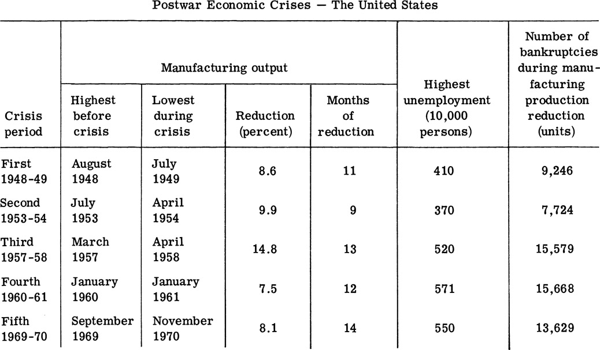

[*8* The Incurable Disease of Capitalism](#) 
==============================================================================

[Economic
Crises](#)<a id="s_a">[\*](#bot_s_a)

Economic crises are the natural product of capitalist economic
development. They are pronounced manifestations of the intensification
of various contradictions in capitalist production, exchange,
distribution, and reproduction. How do capitalist economic crises arise?
What are their effects on capitalist development? We will talk about
these problems in this chapter.

[Economic Crises Are a Product of the Intensification of the Basic Contradictions in Capitalism](#)
---------------------------------------------------------------------------------------------------------------------------------------------

### _Capitalist Economic Crises Are Crises of Overproduction_

Before capitalism (for example, in the long history of China's feudal
society), there were also many social, economic, and livelihood crises.
Because of the cruel exploitation of the peasant by the landlord class,
the ravages of war, and natural calamities such as floods, droughts,
insect pests, and hailstorms, agricultural production suffered serious
damage, the laboring people lost their homes, and hundreds of thousands
died of hunger and plagues. Social, economic, and
livelihood crises at those times were characterized by insufficient food
grain production. Capitalist economic crises are not characterized by
insufficient production, but by overproduction. The most notable
features connected with capitalist economic crises are: large quantities
of commodities cannot be sold, factories close down, banks fold up,
values of stocks fall, unemployment figures rapidly increase, productive
forces suffer severe damage, and the whole economy is paralyzed and
chaotic.

Capitalist economic crises are crises of overproduction. But the
so-called "overproduction" is not an absolute overproduction; it does
not mean that things produced by society are more than what the masses
can consume. In economic crises, the phenomena described below are
widespread. Textile workers receive dismissal notices saying that there
is an overproduction of yarns and fabrics without sales outlets so
production has to be cut back and workers dismissed. However, the
textile workers and their families are inadequately clothed. Those who
produce fabrics cannot afford them. Miners receive dismissal notices
saying that there is an overproduction of coal necessitating production
and employment cutbacks. Yet, the miners and their families have to
shiver in the cold for lack of money to buy coal. Therefore, capitalist
overproduction is relative overproduction. In other words, social
production is excessive only in relation to the purchasing power of the
masses. During economic crises, inventories pile up in the warehouses of
the capitalist for lack of demand. Commodities may be rotting away or
even artificially destroyed. On the other hand, the broad laboring
masses are too poor to afford food and clothing and are struggling on
the verge of starvation.

The economic crisis of overproduction is a special feature of the
capitalist economy. Nevertheless, the possibility of economic crises is
latent in the development process of the commodity economy from the
beginning. When the commodity producer sells his commodities, he does
not always immediately use the money obtained to buy means of production
or required daily commodities. However, if he does not buy, then those
commodity producers who trade with him cannot sell. Here
dislocations between sales and purchases may arise, and the possibility
of crises exists. However, when commodity production was carried on by
petty commodity producers and based on individual ownership, the purpose
of production was to trade for other commodities to maintain production
and satisfy personal consumption needs. Therefore, sales were usually
followed by purchases. At the same time, the productive forces were low,
and the scale of production small. Society's division of labor was not
well developed, and production interdependencies were not very close.
Even if dislocations between sales and purchases arose, their effects
were local and would not lead to economic crises affecting the whole
society. Therefore, even though commodity production itself embodies the
possibility of crises, the inevitability of crises can only be found in
the capitalist economic system itself.

### _The Source of Economic Crises Lies in the Basic Contradiction of Capitalism_

Economic crises in the capitalist society are inevitable. This is
determined by the basic contradiction of capitalism. Stalin pointed out:
'The source and cause of economic crises of overproduction lie in the
capitalist system itself. The source of crisis lies in the contradiction
between the social nature of production and the capitalist ownership of
products." <a id="1">[[1]](#bot_1)</a>

Why does the basic contradiction of capitalism inevitably lead to
economic crises?

First of all, the basic contradiction of capitalism inevitably manifests
itself in a contradiction in which the productive forces greatly
increase while the purchasing power of the laboring people relatively
decreases. Capitalist large-scale social production is very different
from individual handicraft production. Individual production is
characterized by simple reproduction. Even under very favorable market
conditions, its growth in production is slow. Capitalist production is
production by big machines and is capable of rapid growth. The
capitalist tries his best to expand production in search of
more profit because the larger the scale of production, the more surplus
value he can extract. At the same time, the capitalist must also try to
improve his techniques and expand his scale of production in order to
avoid being squeezed out by other capitalists. With the expansion of
production, the standard of consumption must also be increased so that
the increased production of commodities can be sold and social
production continued. But under the condition of private ownership of
the means of production, the capitalist always tries to reduce wages to
the lowest possible level. The development of capitalist production and
the adoption of new techniques inevitably keep a large number of workers
outside the factory gates and expand the ranks of the unemployed.
Capitalist competition inevitably renders a large number of peasants and
handicraftsmen bankrupt so that small capital is squeezed out or
swallowed by big capital. Thus, on the one hand there is an immense
growth of production, and on the other hand there is a relative decrease
in the purchasing power of the laboring people. This contradiction makes
the economic crises of overproduction inevitable.

The basic contradiction of capitalism also inevitably leads to economic
crises because the contradiction inevitably manifests itself in a
contradiction in which the production of individual factories is
organized while social production is chaotic. As production becomes
social, the relationship and interdependency among production sectors
and among various enterprises are increasingly close. For example, the
cotton required by the textile mill is supplied by the agricultural
sector, and spinning and weaving machines by the machine-building
industry. Therefore, in a given period of time, there must be a unified
plan and arrangement to determine the necessary amount of cotton, cloth,
and spinning and weaving machines so that social production can be
smoothly carried out. However, capitalist private ownership of the means
of production divides the whole society into numerous autonomous
capitalist enterprises. From the viewpoint of one enterprise, its
workers are all controlled by one capital, and its internal production
is organized. But from society's viewpoint, what and how
much the various enterprises of different capitalists produce are the
private business of individual capitalists. Nobody else can say anything
about it. Therefore, the production of the society as a whole is carried
on under anarchic conditions. Because social production is
uncoordinated, individual capitalists cannot possibly know the actual
demand for a certain commodity. Provided that there is profit,
capitalists will compete among themselves to expand production. At the
same time, capitalist commercial activities may also create false demand
that conceals the society's actual purchasing power. Even though
production actually exceeds the purchasing power of the masses, as long
as the market price continues to go up, commercial capitalists will
still order from industrial capitalists, and financial capitalists will
still extend credit to industrial and commercial capitalists to
facilitate industrial capitalists to expand production, thus creating
false prosperity in the market. This false prosperity conceals the
existence and development of overproduction. When overproduction is
finally exposed, it is revealed through an avalanche of economic crises.

Thus we see that the source of economic crises lies in the capitalist
system itself and in the basic contradiction of capitalism in which
production is social but means of production are privately owned. As
long as capitalism exists, economic crises are bound to explode. To
eliminate crises, the capitalist system must first be destroyed.

### _Marxist Theory of Economic Crises Demolishes All Fallacious Theories of the Bourgeoisie Designed to Conceal Crises_

The bourgeoisie and its apologists harbor extreme fear and hatred of the
scientific conclusions about capitalist economic crises reached by
Marxism. They have racked their brains to fabricate various lies in a
vain attempt to dissociate crises with the capitalist system in order to
deceive the working people and maintain the capitalist exploitative
system. For example, some of them attribute the source of
crises to "underconsumption" and propose to use "consumption
stimulation" to eliminate crises. In fact, underconsumption by the
laboring people did not come into existence after the appearance of
capitalism. It has been in existence ever since the human society was
divided into the exploiting and the exploited classes. But
overproduction appears only in the capitalist society. It is, therefore,
easy to see that economic crises cannot be explained by
"underconsumption."

After the Second World War, the militarization of the national economy
led to temporary false prosperity in some capitalist countries. The
apologists of the bourgeoisie seemed to have a lifesaving straw. They
made the nonsensical statement that "those who hold the view that the
capitalist countries would inevitably run into great economic crises are
all mistaken." They saw the increasing participation of the governments
of capitalist states in national economic activities as being "automatic
regulators" which would, to a certain extent, enable the development of
the capitalist economy to "automatically tend toward stability." This is
also a lie. We know that the capitalist state machinery serves the
bourgeoisie. Whatever the bourgeois state does to militarize the
national economy or to regulate economic life, it does through various
measures in order to intensify the exploitation of the people so that
the capitalist can get richer. As Lenin pointed out long ago: 'Whether
in the United States or Germany, the result of 'regulating economic
life' is to create military hard-labor camps for the worker (and part of
the peasantry) and to build havens for the banker and the capitalist.
The regulating measures of these countries consist in tightening the
belt of the worker to the verge of starvation while on the other hand
guaranteeing (using secret and reactionary bureaucratic methods) that
capitalist profit is higher than before the war."
<a id="2">[[2]](#bot_2)</a> The
regulation of economic life in the bourgeois countries has not only not
made the capitalist economy "automatically tend toward stability," on
the contrary, it has impoverished the laboring people and diminished the
market while enriching the capitalists. The basic contradiction of
capitalism has steadily intensified, and the economic crises of
capitalism have become more serious.

[The Worsening Tendency of Capitalist Economic Crises](#)
---------------------------------------------------------------------------------------------------

### _Capitalist Economic Crises Explode Periodically_

As long as the capitalist system exists, the basic contradiction of
capitalism will play its role. Capitalist economic crises are not
problems which break out once or twice, but inevitably appear
periodically. Looking at history, we see that the first large-scale
economic crisis appeared in 1825 in England. After that, economic crises
appeared repeatedly in 1836, 1847, 1857, and 1867. They occurred on the
average of once every ten years. After these, they continued to explode
with ever greater severity.

The cycle of economic crisis is the period of time between two
successive crises. It consists in general of the four phases of crisis,
depression, recovery, and boom. Of these, the phase of crisis is basic.
It is the end of the last cycle and the beginning of a new cycle.

The Crisis Phase: Crises often strike suddenly. Before their arrival,
there is widespread false prosperity in the market, and "business is
thriving" in various industries. Although production already exceeds
actual needs, plants are still working at full speed to fill up the
warehouses and meet orders because of the credit system and active
speculative activities. All of a sudden, an economic crisis arrives due
to a dislocation in one of the links in the capitalist economy. Once
overproduction in one field is revealed and sales become difficult,
other fields are soon affected, leading to a chain reaction. For
example, production cuts or suspension in the automobile industry due to
overproduction inevitably affect the coal, electric power, and
transportation industries. Commercial speculators who initially help
boost the false prosperity now turn around to unload their stocks at
reduced prices, thus worsening the situation. Now the warehouses are
overstocked, sales are difficult, and prices drop rapidly.
To arrest the drop of prices, the capitalist may even resort to
destroying large quantities of commodities. Under the blow of slow sales
and falling prices, many medium and small enterprises go bankrupt en
masse, and many banks close down. Those plants which continue to operate
reduce their scale of production. At this time, the number of unemployed
workers from all industries rapidly increases, and the whole economic
situation rapidly worsens.

The Depression Phase: After the stormy assaults in the crisis phase, the
tide of insolvency among industrial and commercial enterprises subsides.
Those enterprises which survive the crisis conduct their activities on a
smaller scale. Although shops are brightly decorated and their salesmen
shout loudly, business is still very poor. A large number of workers are
still unemployed with no means of livelihood. Capitalist industry,
commerce, and banking are in the doldrums. However, in this phase,
social consumption is still carried on. Stockpiles of commodities, after
much damage, are sold slowly at very low prices. Under the surface of
the doldrums, factors promoting the recovery of production slowly
accumulate.

The Recovery Phase: With the reduction in stockpiles, prices slowly
recover, and profits increase gradually. The capitalists step up their
exploitation of the worker on the one hand and improve techniques and
purchase new equipment on the other. Thus, production in the first
category such as electric power, iron and steel, and machine building is
the first to expand step by step. Employment gradually increases in this
category. And the increase in employment leads to an increase in demand
for consumer goods, thus stimulating the development of production in
the second category. In this way, production gradually recovers, and the
number of unemployed decreases. The once depressed capitalist economy is
again gradually on its way to recovery.

The Boom Phase: The basic characteristics of this phase are rapid sales
of commodities in the market, high profit, quickening activities in
production and exchange, and the revival of credit and speculative
activities. There is widespread "prosperity" in the market.
The capitalists all try hard to expand production. Thus, under the
surface of widespread "prosperity," new factors for another crisis
steadily accumulate. Engels described this lively phenomenon of the
capitalist economy as: "Motion is quickened; slow steps turn into quick
steps. Industrial quick steps turn into running steps. Running steps in
turn become a sprint in a handicapped race in industry, commerce,
credit, and speculative activities. In the end, after several final,
desperate jumps, it falls into an abyss of collapse."
<a id="3">[[3]](#bot_3)</a>

Crisis --- depression --- recovery --- boom --- crisis characterizes the
cyclical nature of economic crises. It also manifests the cyclical
nature of capitalist production. It shows that capitalist production
cannot progress continuously, but can only advance on a zigzag course.

### _Capitalist Economic Crises Worsen Steadily_

In the development process of capitalist production, economic crises
repeatedly appear. But each crisis is not a simple recurrence of the
previous crisis. Capitalist economic crises tend to worsen steadily.
Especially after the Second World War, economic crises have become more
frequent and more severe. This is manifest in the following aspects:

First, the cycle of economic crises has shortened, and economic crises
are becoming more frequent.

Before the Second World War, economic crises occurred once every ten
years. In the twenty-odd years after the Second World War, the cycle of
economic crisis shortened markedly.

We can clearly see from the following tables that after the Second World
War there were five economic crises in the United States and Japan. The
average time between the first and the fifth crisis was less than five
years in the United States and less than four years in Japan. After the
Second World War, the cycle of economic crises markedly shortened
because, under the rule of monopoly capital, the laboring people are
subject to increasing exploitation, their purchasing power is reduced
relatively, and problems of the domestic market are intensified.
Furthermore, because of the external aggression and
expansion of various imperialist countries, the contradictions between
imperialism and the people of colonies and satellite countries are
intensified. This promotes national revolutions in the colonies and
satellite countries and consequently reduces the size of the foreign
markets. Sales become a chronic problem. Thus, the contradiction between
production and consumption is steadily intensified. All these show that
the basic contradictions of capitalism are becoming ever more acute, and
the capitalist production relation imposes an ever more serious obstacle
to the development of the productive forces.

Second, the blind replacement of fixed capital makes the ratio of
capitalist reproduction more out of balance. Before the Second World
War, whenever economic crises exploded, investment in fixed capital
usually dropped rapidly. However, after the Second World War, investment
in fixed capital was generally higher than before the war. Even during
crises, the level of investment still remained relatively high. In the
fifth economic crisis in the United States after the war, investment in
fixed capital not only did not fall, it went up instead. There was an
increase of 3.5 percent between 1969 and 1970. In the fifth economic
crisis in Japan after the war, investment in fixed capital in 1971 was
3.2 percent higher than in 1970.

The higher level of investment in fixed capital after the war shows
that, on the one hand, the monopoly bourgeoisie uses the state machinery
to increase its exploitation of the laboring people and transforms the
surplus value extracted from the worker into capital. This speeds up
capital accumulation but also speeds up the impoverishment of the
proletariat and further reduces the purchasing power of the people. On
the other hand, it shows that investment in fixed capital in the United
States after the war consisted primarily of military orders and demands
related to armaments and war preparations. Not only was a large amount
of social resources wasted, but also the first category of industries
was expanded without any control. As a result, the ratio of social
reproduction was even more out of balance, and the contradiction of
capitalist reproduction

became more acute. And capitalist economic crises became
more frequent and more severe.

Third, manufacturing crises are interwoven and interact with
agricultural crises, intensifying the whole economic crisis. Under the
capitalist system, economic crises occur not only in manufacturing but
also in agriculture. When agricultural crises explode, they are
reflected in rapidly increasing stocks in the warehouse of the
agricultural capitalist, falling wholesale prices, shrinking cultivated
acreage, increasing unemployment of agricultural workers, falling wages
among those still employed, and mass bankruptcy among individual
farmers. It can be seen that agricultural crises, like manufacturing
crises, arise because of overproduction and are caused by the basic
contradiction of capitalism. As long as the capitalist system exists,
agricultural overproduction crises are just as inevitable as
manufacturing overproduction crises.

But, compared with manufacturing crises, agricultural crises last much
longer. In the twenty-three years since the agricultural crisis exploded
with the manufacturing crisis in 1948, agriculture has never been able
to free itself from overproduction.

The intertwining and interaction between industrial and agricultural
crises has become a serious problem in the postwar United States
economy. Manufacturing crises lead to insolvency in a large number of
enterprises, production cutbacks, unemployment, and falling wages. As a
result, demand for agricultural products is reduced, aggravating the
crisis of agricultural overproduction. At the same time, agricultural
crises also damage agricultural production and impoverish agricultural
laborers. Consequently, demand for agricultural means of production and
manufacturing products is reduced and crises of manufacturing
overproduction are intensified. Under the influence of manufacturing and
agricultural crises, capitalist economic crises inevitably worsen.

Fourth, the crisis of capitalist overproduction is interwoven with the
fiscal and financial crisis. After the Second World War, at the same
time when the cycle of capitalist economic crises shortened, the
explosion of fiscal and financial crises became more
frequent. Fiscal and financial crises often occur along with economic
crises. Fiscal and financial crises, like economic crises, are an
inevitable result of a further intensification of the basic
contradiction of capitalism. Their major features are: budgetary
deficits, indiscriminate expansion of money supply, rising prices,
balance-of-payments deficits, dwindling gold reserves, and currency
devaluation.

After the Second World War, in order to free themselves of the worsening
economic crises, the imperialist powers vainly attempted to resort to
armament and war preparations to stimulate national economic growth.
However, military expenses and production expenses of the defense
industry rose steadily, leading to chronic budget deficits. To pay for
the hugh defense expenses, imperialist countries have tried hard to
increase taxation, negotiate foreign loans, issue currency, and engineer
inflation, leading to fiscal crises. From the fiscal year 1946 to 1971,
the United States budget deficits amounted to 137.9 billion dollars. The
public debt reached 424.1 billion dollars. Even United States government
officials claimed in dismay that the "United States public debt was
larger than those of all other countries combined." "If we converted
these public debts into United States one dollar notes, they could form
a belt 35 feet wide encircling the equator 1,520 times."

As inflation worsens, the value of money falls steadily, leading to
ever-rising prices. In the past, before the explosion of an economic
crisis, in general the price level would fall. But since the Second
World War, the capitalist countries have been bent on adopting the
militarization of the national economy and have pursued a policy of
inflation. As a result, prices not only have not fallen during crises,
but have gone up instead. For example, there have been five economic
crises in the United States since the Second World War. With the
exception of the crisis in the 1948-49 period, prices in the other four
periods all rose. This indicated that purchasing power fell. The
devaluation of a currency inside a country inevitably affects its
external credit standing. United States imperialism launched successive
aggressive wars. With large increases in the army stationed
overseas and in military expenditures, the huge outflow of United States
dollars sent its international credit standing plummeting. Since the
Second World War, financial crises have occurred repeatedly in the
financial market of the capitalist world. Massive sales of United States
dollars and rushes for gold have forced the United States government to
devaluate the dollar twice: once at the end of 1971 and again in
February 1973. The hegemony of the United States dollar in the
capitalist world has disintegrated.

The concurrence of economic and financial crises has bogged down the
capitalist economy in a deep quagmire. On the one hand, economic crises
have led to a plunge in production and a steady impoverishment of the
laboring people and have reduced the revenues of the capitalist
countries, resulting in large deficits in federal budgets and in
balance-of-payments which aggravate fiscal and financial crises. On the
other hand, with the fiscal and financial crises worsening, inflation,
higher taxation, falling real wages, and relative reduction in the
purchasing power of the masses have inevitably further aggravated the
economic crises of overproduction.

We can thus see that the cyclical nature of capitalist economic crises
forms a vicious circle which gets worse and worse. The inherent
antagonistic contradiction in capitalism is further intensified. Crises
on top of crises have shaken the whole capitalist world like so many
wild rainstorms.

[Economic Crises Undermine the Basis of Capitalist Rule](#)
-----------------------------------------------------------------------------------------------------

Economic crises further intensify the basic contradiction of capitalism.
During crises, competition among capitalists becomes more acute. Many
medium and small enterprises, unable to compete with big enterprises,
are the first to go bankrupt. To pay off their debts, many medium and
small enterprises are forced to be auctioned off at losses. A few big
enterprises which are more competitive take the opportunity to buy in at
low prices. Therefore, after each crisis in the capitalist
society, capital becomes more concentrated in the hands of
a few capitalists. Concentration of production and capital is hastened.
The increasing concentration of production and capital implies that the
basic contradiction of capitalism, namely, the contradiction between
social production and capitalist private ownership, is becoming more
acute.

Economic crises intensify class contradictions in the capitalist
society. To reduce their own losses during crises, the capitalists
inevitably take the knife to the laboring people. They dismiss workers
en masse, cut wages, resort to inflation, increase taxation, and try
their best to shift the burden of the crises onto the shoulders of the
laboring people. At the same time, during crises, the exploitation of
agriculture by capitalist manufacturing and of the rural areas by the
urban areas also increases, resulting in mass bankruptcy among the
peasants. Therefore, capitalist economic crises inflict severe hardship
on the working class and other laboring people and intensify the
contradiction between the workers and peasants on the one hand and the
bourgeoisie and big landowners on the other, causing the proletariat's
tide of struggle against the bourgeoisie to get higher and higher. Thus,
the foundation of capitalist rule is continually rocked.

Economic crises fully expose the transitory nature of the capitalist
system, revealing the existence of antagonistic contradictions between
capitalist production relations and productive forces. The capitalist
production relation is too confining for the huge social productive
forces. It severely restricts the development of productive forces.
During crises, only after immense destruction of productive forces and
drastic reductions in production can the contradiction between
production and consumption be temporarily and forcibly resolved. But at
the same time, factors leading to another crisis are gradually
accumulating. In the development process of the capitalist economy,
there is a tendency for economic crises to get worse. This indicates
that the capitalist production relation is decaying and must be replaced
by another, new production relation which can adapt to the developmental
needs of new productive forces, namely, the socialist production
relation.

### _Major Study References_

Engels, _Anti-Duhring_, pt. 3, chap. 2.

Lenin, 'The Lessons of Crises," _Complete Works of Lenin_,
Vol. 5.

### _Review Problems_

1\. What is the source of capitalist economic crisis?

2\. Why do we say that economic crises hasten the downfall of capitalism?

_Notes_
-------------------

<a id="bot_s_a">[\*](#s_a)</a> Tzu-pen chu-i chih-tu ti "pu chih chih cheng"
--- ching-chi wei-chi.

<a id="bot_1">[[1]](#1)</a> "Political Report to the Sixteenth Congress of
the Central Committee of the Communist Party of the Soviet Union
(Bolshevik)," _Complete Works of Stalin_, Vol. 12, p. 214.

<a id="bot_2">[[2]](#2)</a> "Where Is the Way Out in the Face of an
Impending Catastrophe?," _Complete Works of Lenin_, Vol. 25,
p. 324.

<a id="bot_3">[[3]](#3)</a> Engels, _Anti-Dühring_, _Selected
Works of Marx and Engels_, Vol. 3, Jen-min ch'u-pan-she,
1972, p. 316.
