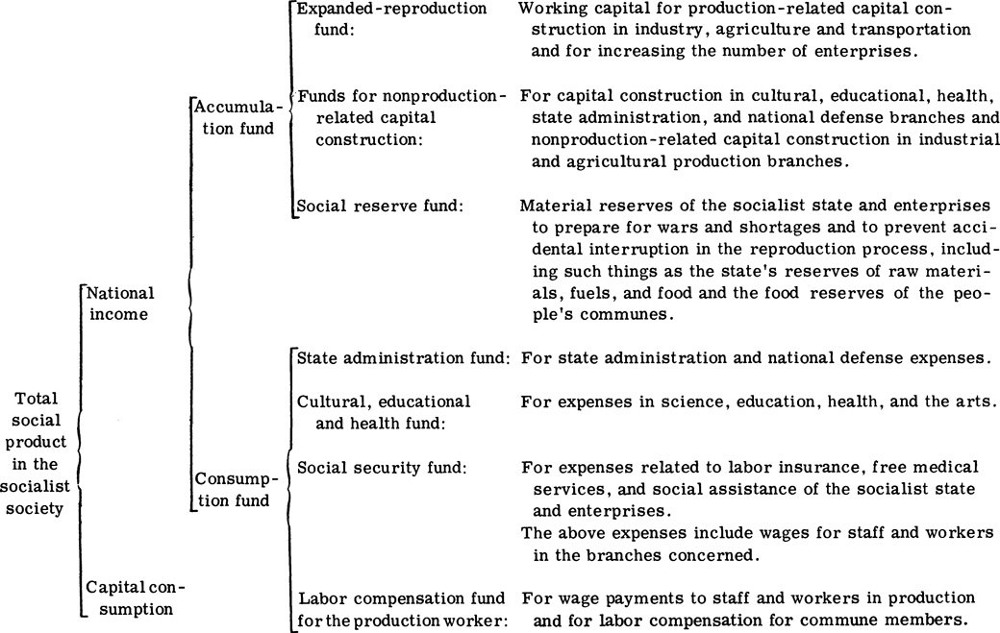

[*20* Correctly Handle the Relations among the State, the Collective, and the Individual](content.xhtml#bck_Ch020) 
===============================================================================================================================

[The Distribution and Redistribution of the Socialist National
Income](content.xhtml#bck_Ch020)[\*](Ch020.xhtml#fn20_1)

Products produced in socialist society must generally go through
exchange and distribution before they are consumed. The repeated and
continuously renewing process of production, exchange, distribution, and
consumption is a process of reproduction. The correct handling of the
relations among the state, the collective, and the individual with
respect to distribution and the correct distribution of the social
product and national income play an important role in the smooth conduct
of socialist reproduction.

<a id="The Socialist National Income Comes from the People and Is Spent on the People">[[The Socialist National Income Comes from the People and Is Spent on the People]](#bot_The Socialist National Income Comes from the People and Is Spent on the People)</a>
-------------------------------------------------------------------------------------------------------------------------------

### _The Socialist National Income Can Continuously Increase at a High Speed_

Socialist reproduction has its own characteristics. These
characteristics are actually simply the repeated occurrence of the
characteristics of socialist production. The purpose of
reproduction is to satisfy the ever-increasing needs of the
socialist state and the people. It is not for the purpose of
exploitation as in capitalism. Socialist reproduction is carried on in a
planned and proportional way. It is not the blind competition of
capitalism. Socialist reproduction is continuous expanded reproduction.
It is not interrupted by cyclical economic crises as in capitalism.
These characteristics of socialist reproduction are inevitably reflected
in the creation and distribution of the socialist national income.

National income is the total social product produced by the laborers of
the material production branches in a country at a given period of time
(usually a year) minus the depreciation of the means of production. It
is the wealth created by the laborer of the material production
branches.

Because of the dual character of socialist production, the national
income created by socialist production is manifested in products as well
as in value. National income in the form of products cannot be
calculated by simple addition because of the different variety of
products. But since it has value, its total and rate of increase can be
calculated at current prices or constant prices.

The main factors determining the creation and increase of national
income are as follows: increases in social labor, increases in labor
productivity, and savings in the social consumption of the means of
production.

In general, other factors being equal, the higher the amount of labor
engaged in social production, the higher the national income created,
both in physical and in value terms. Under socialism, the purpose of
production and reproduction is to satisfy the ever-increasing needs of
the state and the people. The scale of reproduction increases year after
year, and the national income can also sustain its growth. Under
capitalism, the purpose of production and reproduction is exploitation.
The expansion of reproduction is often interrupted by economic crises.
Relative overproduction is aggravated, leading to mass unemployment
which is a unique social problem in capitalism. This way, the increase
in the capitalist national income will certainly be adversely affected.

Also, if the amount of labor is constant, then the faster
the labor productivity in the production enterprise is increased, the
faster the physical volume of national income, that is, national income
computed at constant prices, will increase. In socialist society, the
initiative and activism of the laboring people can be fully exercised.
Advanced technology can be widely disseminated. The unfolding of mass
technical innovation and technical revolution provides a broad vista for
increasing labor productivity and national income. In capitalist
society, the laboring people are oppressed and exploited. The initiative
and activism of labor are suppressed. Advanced technology is used only
if it results in more surplus value. Therefore, the increase in labor
productivity and national income face tremendous obstacles.

Let us look at the third factor in determining national income. If the
total social product is fixed, then the more the means of production are
saved in the production process, the smaller the deduction from the
total social product will be and the faster the growth of national
income will be. In socialist society, the laboring people are the
masters. They can be actively concerned with the saving, substitution,
and comprehensive utilization of raw materials and the regular
maintenance and full utilization of the means of production. The planned
nature of socialist reproduction enables the means of production to be
more fully and rationally utilized in the whole society. All these make
it possible to save the means of production, reduce their consumption,
and increase national income. In capitalist society, although the
capitalist tries to save the means of production to reduce capital
expenses, a large amount of waste results from competition and chaotic
production. In addition, underutilization of capacity in the enterprises
frequently idles a large amount of equipment. All these are unfavorable
to increasing national income.

Because the factors determining the creation and growth of national
income are different under different social conditions, the national
income of the socialist country can increase faster than the national
income of the capitalist country in the long run.

### _The Distribution of National Income Complies with the Basic Interests of the Laboring People_

How is national income to be distributed after it has been created? The
distribution of national income is ultimately determined by the
ownership pattern of the means of production. In socialist society, the
means of production are publicly owned. The laboring people are the
masters in production. Therefore, the distribution of national income
must comply with the interests of the laboring people and satisfy the
ever-increasing needs of the state and the laboring people in a planned
manner.

National income is created by the laborer in the material production
branches. It must first undergo an initial distribution in the material
production branches. In enterprises under the socialist state ownership
system, national income is divided into two parts after the initial
distribution: One part is wages to be used by the laborer in state
enterprises for personal consumption; the other part is net income to
become the centralized net income of the state after it is surrendered
to the state in the form of taxes and profits.

In enterprises under the collective ownership system, after a primary
distribution, one part of the national income becomes labor compensation
for commune members for personal consumption; the other part becomes the
net income of the collective. The net income of enterprises under the
collective ownership system, unlike state enterprises, is not
surrendered wholly to the state. A part of it is surrendered to the
state as taxes to become part of the centralized net income of the
state. The other part is retained as a public accumulation fund and a
public welfare fund to be used for expanded reproduction of collective
enterprises and collective welfare.

After the initial distribution in the material production branches, the
socialist national income becomes state income, income of collective
enterprises, and income of individual laborers. It is an important
matter of principle to correctly handle the relations between the state,
the collective, and the individual with respect to distribution.
Chairman Mao teaches us: "In distribution, we must consider
the interests of the state, the collective, and the individual. The
relations among state taxes, accumulation by the cooperative, and
individual income of the peasant must be appropriately handled, and the
contradictions among them must be regulated regularly."
<a id="1">[[1]](#bot_1)</a> This instruction of
Chairman Mao referred to the collective economy. But this principle also
applies to the distribution of the whole national income.

After the initial distribution, a part of the national income must be
reinvested (or plowed back into the economy), thus creating income
again. <a id="2">[[2]](#bot_2)</a> Why must
national income be redistributed? This is because in socialist society,
in addition to the material production branches, there are also
cultural, educational, and health branches, some service industries, the
armed forces, and state administration organs. These nonmaterial
production branches do not create national income, but they are
necessary for the development of socialist society, the enrichment of
the material and cultural life of the laboring people, and the
consolidation of proletarian dictatorship. The personal income of the
laborer in these nonproduction branches is provided through a
redistribution of the national income. In addition, a redistribution of
the national income is needed to satisfy the needs for social welfare
and social assistance. This way, it becomes the personal income of those
who enjoy such welfare and assistance.

The redistribution of the national income is carried on mainly through
the socialist state budget, but activities of service industries can
also bring about a redistribution of the national income. For example,
barber shops and laundries charge certain fees to those who have
received their services. From these charges, a part is used to pay wages
to their employees. This way, personal income from the initial
distribution is transformed into personal income of laborers in service
industries, constituting a redistribution of the national income.

The redistribution of national income is also carried on to some extent
through price adjustments. For example, the lowering of selling prices
for industrial products and the raising of procurement
prices for agricultural products in effect increase the income of the
peasant.

National income in socialist society is divided into two parts after
distribution and redistribution: One part is under the control of the
socialist state and enterprises under the collective ownership system to
expand reproduction and satisfy other common social needs. The other
part belongs to the individual laborer to satisfy his personal
livelihood needs. These two parts of the national income are finally
grouped into accumulation funds and consumption funds according to their
different uses.

After distribution and redistribution of the social product and the
national income, the final result can be categorized as in the table on
the facing page.

After distribution and redistribution, the part of the socialist
national income which goes for the laborer's personal consumption
contributes directly to his welfare. The part that goes to society
contributes to the laborer's collective welfare and his long-term
interests. Just as Marx said: "All the deductions from the producer as
an individual will be directly and indirectly used for the welfare of
this producer as a member of society."
<a id="3">[[3]](#bot_3)</a>

The socialist national income comes from the people and is spent on the
people. It is fundamentally different from the distribution of the
national income in the old society. In a society dominated by the
exploitative class, the national income created by the laboring people
is largely expropriated by the exploitative class to support a handful
of parasites. People like Lin Piao vainly attempted to restore in China
this order in which man exploits man. They advocated what Mencius, a
faithful disciple of Confucius, said: "Without the gentleman, no one
will rule the uncultured, without the uncultured, no one will support
the gentleman." In their eyes, the domination and oppression of the
laboring people were immutable laws. However, today is the age of
imperialism and proletarian revolution; the exploitative system is
doomed. This system is already extinct in socialist society. The
laboring people will no longer support the "gentleman" of the
exploitative class. People like Lin Piao

who vainly attempted to turn history backward could not
escape being crushed by the wheel of history.

<a id="The important Role of Public Finance in the Distribution and Redistribution of National Income">[[The important Role of Public Finance in the Distribution and Redistribution of National Income]](#bot_The important Role of Public Finance in the Distribution and Redistribution of National Income)</a>
-----------------------------------------------------------------------------------------------------------------------------------------------

### _The State Budget Is an Important Link in the Financial System_

In socialist society, the distribution and redistribution of national
income is carried on mainly through finance. The socialist financial
system consists of the state budget, state bank credits and loans, and
state enterprise finance. Of these, state enterprise finance is the
basis of the socialist finance system. It systematically reflects the
use and turnover of capital funds in the production activities of
enterprises. It also effects an initial distribution of national income
to form the centralized net income of the state. State banks distribute
temporarily idle funds in the national economy through loans to meet the
needs for short-term working capital in production. The state budget
obtains its revenues from its participation in the distribution of
national income to meet the needs of consolidating proletarian
dictatorship and economic and cultural construction. A fairly large part
of the national income, especially a major part of socialist
accumulation, is effected through state budget allocations. The state
budget is a major link in the socialist finance system.

How does the state budget participate in the distribution of national
income? Because the state budget consists of revenues and expenditures,
this question has to be answered from the two aspects of the budget:
revenues and expenditures. Budget revenues of the socialist state
generally include income from enterprise and services, various taxes,
and other income items. These budget income items come largely from the
net income of socialist enterprises. In China, the net income of
socialist state enterprises are at present surrendered entirely to the
state budget in the form of taxes and profits. As early as 1959,
payments surrendered by China's state enterprises
represented 91.8 percent of the state budget. Payments surrendered in
the form of taxes by rural people's communes represented 7.4 percent of
the state budget. Together, the two sources represented 99.2 percent of
state budget revenues. In China's budget revenues, the items of public
debt and foreign debt no longer exist. China has become a socialist
country without any internal or external debt.

Socialist state budget expenditures generally include economic
construction expenditures, social, cultural, and education expenditures,
and national defense and foreign aid expenditures. Through these budget
expenditures, various funds are established in a planned manner to meet
the needs of consolidating proletarian dictatorship, expanding
production, and developing cultural, educational and health services.
Among budget expenditures, economic construction and social, cultural,
and educational expenditures are of major importance. Expenditures for
these two items increased from about 36 percent in 1950 to about 70
percent of China's state budget expenditures in 1970. However, in
imperialist and social imperialist countries, in order to encroach upon
and plunder the laboring people of foreign countries and to oppress and
exploit the laboring people of their own countries, expenditures for
armament expansion and government administration represent a very
substantial proportion of state budget expenditures. Expenditures often
exceed revenues, resulting in sizable budget deficits.

The above conditions show that socialist finance is a distribution
relationship centering on the socialist state's participation in the
distribution and redistribution of national income. Its purpose is to
consolidate proletarian dictatorship, develop the economy and cultural,
educational, and health services, and discharge its internationalist
obligations. The differences between socialist finance and capitalist
finance lie in the fact that socialist finance ultimately serves the
interests of the broad masses of laboring people, rather than
encroaching on those interests, and that it participates in the
distribution and redistribution of national income outside the
production sphere, as well as in the production sphere. It
links the state budget, state bank credit, and state enterprise finance
closely together to serve production growth.

### _The Economy Determines Finance, and Finance Affects the Economy_

Since socialist finance is a relationship of distribution and
redistribution of national income centered on the state, it is thus
closely related to the development of the national economy. Marxism
tells us that production determines distribution and distribution in
turn affects production. Different forms of distribution in different
societies are determined by different forms of social production. And
the wealth made available by society for distribution is also determined
by the national income created by the production sphere. Chairman Mao
instructed us on the dialectical relations between the economy and
finance: "To develop the economy and guarantee surplus constitute the
general policy of our economic and financial work." "Whether financial
policies are good or bad will certainly affect the economy. But what
determines finance is the economy."
<a id="4">[[4]](#bot_4)</a> Since liberation,
the vast numbers of financial personnel have followed Chairman Mao's
instruction. They first paid special attention to the economy to promote
a sustained increase in industrial and agricultural production. As a
result, a stable and reliable material basis for China's finance has
been secured, and the scale of revenues and expenditures has developed
at a relatively high speed. From 1950 to 1970, China's total
agricultural production in value terms increased by 1.1 times, and the
total industrial production in value terms increased by 13.1 times.
China's state budget revenues increased by more than 9 times and state
budget expenditures increased by more than 8 times.

The fact that the economy determines finance shows that a one-sided
emphasis on finance, an ignorance of the importance of developing the
economy, and a pure financial viewpoint which seeks to solve financial
problems through purely financial means are erroneous. People holding a
purely financial view-point who do not understand the
dialectical relations among the economy, finance, production, and
distribution and do not actively concern themselves with and promote
production growth will not be able to solve the problem of financial
revenues and expenditures.

The economy determines finance, but finance is not simply a passive or
negative factor. It, in turn, plays a very important role in economic
development. When the state wants to carry out economic construction and
the enterprise wants to increase production, the necessary funds must be
arranged. Through its participation in the distribution of national
income, socialist finance allocates budget funds from its centralized
net income to state enterprises to provide funds for economic
construction. In the allocation of funds, if a balance can be achieved
in the distribution of material resources, in other words, if the
movement of value can be tied up with the movement of material resources
(that is, the movement of use values) so that a certain amount of funds
can be exchanged for a corresponding amount of material resources and so
that they are used economically and properly, a high-speed development
of the national economy in a planned and proportional manner can be
guaranteed. Conversely, if socialist finance misallocates funds, such
that the movement of value does not match the movement of material
resources, or if material resources are not used rationally, the
development of the national economy will be hindered.

Socialist finance centralizes the national income which is created in
the production sphere in the hands of the state. This centralized net
income of the state is then used to develop the national economy. This
in itself is not sufficient. The vast numbers of financial workers,
because of their wide contact with, and their knowledge of, the
conditions of various enterprises, should also help enterprises improve
management and operation, facilitate cooperative relationships, help
enterprises perfect the interrelations within and among enterprises, and
do a better job of tapping potentials in order to continuously promote
the development of social production and the increase in national
income. This way, on the basis of a developing economy, the sources of
socialist finance can be augmented and guaranteed.

<a id="The Proportional Relations between Accumulation and Consumption Are Overall Proportional Relations">[[The Proportional Relations between Accumulation and Consumption Are Overall Proportional Relations]](#bot_The Proportional Relations between Accumulation and Consumption Are Overall Proportional Relations)</a>
----------------------------------------------------------------------------------------------------------------------------------------------------------------

### _Socialist Accumulation Is the Source of Expanded Reproduction_

In the distribution and redistribution of national income, there are
proportional relations between accumulation and consumption which
directly affect the development of the national economy and the
improvement of the people's livelihood. Like the proportional relations
between the two major categories and the proportional relations among
agriculture, light industry, and heavy industry, the proportional
relations between accumulation and consumption are also overall
proportional relations.[\*](Ch020.xhtml#fn20_6)

In the process of distribution and redistribution of national income,
socialist finance must guarantee a certain amount of accumulation to be
used for expanded reproduction. Accumulation is the source of expanded
reproduction. However, in different societies, accumulation has
different characteristics. In capitalist society, the laboring people
are oppressed and exploited. They do not have enough to eat or wear, to
say nothing of accumulation. Only the exploitative class has
accumulation. But this accumulation serves to further the exploitation
and oppression of the laboring people by the exploitative class. In
socialist society, the laboring people control political power and own
the means of production. They can thus accumulate funds through the
state and the collective to be used to expand reproduction and to serve
the interests of the laboring people. The more wealth accumulated by
socialist society, the larger the scale and capacity of social
production and the higher the standard of material and cultural life.
The result will be overall moral, intellectual, and physical
development. Material and spiritual conditions will also be gradually
accumulated for the transition to communist society.

However, all opportunists and revisionists have attempted
to gloss over the essential difference between socialist and capitalist
accumulation. They have advocated a complete distribution of the
socialist national income. More than a hundred years ago, a leader of
the German workers' movement, La Salle, proposed a so-called "undiluted
labor income." Dühring proposed another nonsensical "complete labor
income." Like La Salle, Dühring and other swindlers of the same ilk and
Liu Shao-ch'i also clamored that socialism meant "more distribution" and
"more take-home pay." Lin Piao maliciously slandered China as "a rich
state with poor people." He attacked socialist accumulation as
"disguised exploitation" and conspired to get rid of socialist
accumulation. To such ridiculous propaganda, Marx and Engels dealt
head-on blows in [Critique of the Gotha Program] and
[Anti-Dühring]. If the revisionist fallacies were
implemented, there would not be any social accumulation. As a result,
the socialist economy would not be able to carry on expanded
reproduction. It could only maintain simple reproduction, or the
function of accumulation would be transferred to private parties. This
way, capitalism would be restored. Thus, we can see that the fallacies
of distributing and spending everything advocated by Liu Shao-ch'i and
Lin Piao represent a vain attempt to undermine the socialist economy and
restore capitalism.

### _The Ratio between Accumulation and Consumption Must Be Appropriate_

Aside from what is used as accumulation funds, the rest of the socialist
national income is used as consumption funds. "The problem of
distribution between accumulation and consumption is a complex problem;
it is not easy to solve in a short time."
<a id="5">[[5]](#bot_5)</a> At any
given period of time, the national in-mean that the increase in the
laboring people's standard of living will have to be temporarily slowed
down. Conversely, if the part used to increase consumption is raised,
the part used to increase accumulation must be somewhat lower. A higher
level of consumption can, of course, better satisfy the present
livelihood needs of the laboring people, but the pace of socialist
expanded production must then be slower. This will affect further
improvement of the laboring people's livelihood. These conditions show
that there are contradictions between socialist accumulation and
consumption. But the contradictions are not antagonistic in nature. They
are contradictions among state interests, collective interests, and
individual interests. In other words, they are contradictions between
overall interests and partial interests and contradictions between the
people's longterm and short-term interests.

In arranging the proportional relations between accumulation and
consumption, we must first base any increase in accumulation on
appropriately improving the livelihood of the laboring people. At the
same time, any increase in consumption must also be based on
continuously expanding production and improving labor productivity. The
interests of the state, the collective, and the individual must be
considered simultaneously. If we pay no attention to improving the
livelihood of the laboring people and one-sidedly emphasize
accumulation, it will not meet the objective requirements of socialist
economic development; it will discourage the production activism of the
laboring people. Conversely, if we pay no attention to accumulation and
onesidedly emphasize consumption, it will not be in the basic and
long-term interests of the laboring people. In order to create favorable
conditions for the correct handling of this contradiction, we must
endeavor to develop social production. As long as production is
developed and national income is increased, the livelihood of the
laboring people can still be improved even if accumulation is
appropriately increased. Therefore, for the overall and long-term
interests of socialism, it is necessary to emphasize the revolutionary
spirit of arduous struggle and building the country with
diligence and economy.

Accumulation and consumption are a proportional relation in value terms.
The proper handling of this proportional relation requires corresponding
material resources as a guarantee. As for accumulation, it is used for
capital construction and expanded reproduction. Once a certain amount of
funds is available, there must also be a corresponding amount of the
means of production.
<a id="6">[[6]](#bot_6)</a> Of the total
national product in socialist production, only the added portion is to
be used for expanded reproduction, while the other portion, equivalent
to the previous year's consumption, is to be used for simple
reproduction. Therefore, to maintain a balance between supply and
demand, the total capital fund accumulated must first equal the increase
in the means of production. Otherwise, either the means of production
will fall short of the accumulated fund, making expanded reproduction
impossible, or the added means of production will not be sold, thereby
creating a surplus. In either case, socialist expanded reproduction will
be affected.

As far as consumption is concerned, since consumption funds are used to
satisfy the material and cultural needs of the socialist state and the
broad masses of laboring people, sufficient consumer goods must be
available to guarantee that these needs will be satisfied. If the
increase in consumption funds does not correspond to the increase in
consumer goods, then either the supply of consumer goods will exceed the
demand, resulting in unplanned inventory accumulation, or demand for
consumer goods will exceed their supply, resulting in shortages. Either
way, it will be difficult to attain properly the goal of satisfying the
needs of the state and the laboring people.

It can thus be seen that in order to maintain the proper proportional
relations between accumulation and consumption, it is necessary to
develop production by all means. Only when the production of the means
of production and consumer goods is solved can both accumulation and
consumption be increased and the contradiction between accumulation and
consumption be better resolved. Here, it is of decisive importance to
raise raise labor productivity continuously, use the means
of production thriftly, and create more material wealth without
increasing the use of manpower, material resources, and finance.

### _Major Study References_

Marx, [Critique of the Gotha Program], (1).

Engels, [Anti-Dühring], Part 3, Chapter 4.

Chairman Mao, "On the Correct Handling of Contradictions among the
People," Sections 1 and 3.

Chairman Mao, "Economic and Financial Problems in the Anti-Japanese
War."

### _Review Problems_

1\. How is socialist national income distributed and redistributed? What
is the essential difference between this and the distribution of
capitalist national income?

2\. What is socialist finance? How should we understand the relations
between socialist finance and the economy?

3\. How do we correctly handle the proportional relations between
accumulation and consumption?

[Notes]
-------------------

[\*](#bck_fn20_1) Cheng-ch'üeh ch'u-li kuo-chia, chi-t'i ho
ko-jen chih chien ti kuan-hsi --- she-hui-chu-i kuo-min shou-ju ti
fen-p'ei ho tsai fen-p'ei.

[\*](#bck_fn20_2) The two major categories in socialist
enlarged reproduction are accumulation and personal consumption. ---
Editor.

[1](#bck_fn20_3) "On the Correct Handling of Contradictions
among the People," [Selected Readings from the Works of Mao
Tse-tung], Jen-min ch'u-pan-she (A), 1965, p. 343.

[2](#bck_fn20_4) The centralized net income which the
socialist state obtained in its participation in the first round
distribution of national income is plowed back to the economy for
various purposes. However, not every item of the income thus plowed back
will generate income in the second round of income distribution. For
instance, the state appropriated funds to state operated enterprises for
production purposes that involve neither transfers of ownership nor
creation of income do not go through the process of redistribution of
national income.

[3](#bck_fn20_5) Marx, [Critique of the Gotha
Program, Selected Works of Marx and Engels], Vol. 3, Jen-min
ch'u-pan-she, 1972, p. 10.

[4](#bck_fn20_6) "Economic and Financial Problems in the
Anti-Japanese War," [Selected Works of Mao Tse-tung], Vol.
3, Jen-min ch'u-pan-she, 1968, p. 846.

[5](#bck_fn20_7) "On the Correct Handling of Contradictions
among the People," p. 337.

[6](#bck_fn20_8) A small part of accumulation funds is used to
purchase consumer goods, but the major part is used to purchase means of
production.
